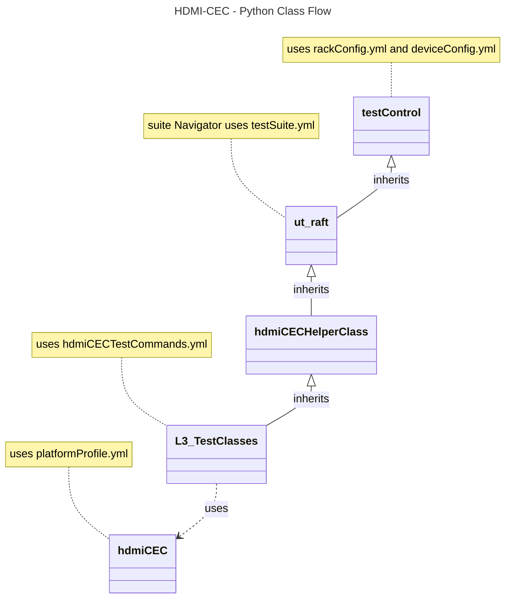

# HDMI CEC L3 Test Document

## Overview

This document describes the L3 Test Procedure for the HDMI CEC module.

## Acronyms, Terms and Abbreviations

- `CEC`    -  Consumer Electronics Control
- `HAL`    -  Hardware Abstraction layer
- `HDMI`   -  High Definition Multimedia Interface
- `API`    -  Application Program Interface
- `SoC`    -  System on Chip
- `DUT`    -  Device Under Test
- `LA`     -  Logical Address
- `PA`     -  Physical Address

## References

- CEC Adaptor: [Pulse Eight](https://www.pulse-eight.com/p/104/usb-hdmi-cec-adapter)
- `HAL` interface file: [hdmi_cec_driver.h](https://github.com/rdkcentral/rdk-halif-hdmi_cec/blob/1.3.9/include/hdmi_cec_driver.h)

## Level 3 Test Cases High Level Overview

|#|Test-case|Description|HAL APIs|Source|Sink|
|-|---------|-----------|--------|------|----|
|1|Transmit CEC Commands|Send predefined `CEC` commands from the DUT and verify if the command is successfully transmitted using the CEC adapter| `HdmiCecTx()`|`Y`|`Y`|
|2|Receive CEC commands|Send predefined `CEC` commands from the CEC adapter, verify if the `DUT` successfully receives the command, and check the response through call-backs.| `HdmiCecTx()`|`Y`|`Y`|

## Level 3 Python Test Cases High Level Overview

The class diagram below illustrates the flow of HDMI CEC Python test cases:

- **testControl**
  - Test Control Module for running rack Testing. This module configures the `DUT` based on the rack configuration file provided to the test.
  - This class is defined in `RAFT` framework. For more details refer [RAFT](https://github.com/rdkcentral/python_raft/blob/1.2.0/README.md)
- **ut_raft**
  - Python based testing framework for writing engineering tests.
  - It provides common functionalities like menu navigation, configuration reader, reading user response etc.
  - For more details [ut-raft](https://github.com/rdkcentral/ut-raft/tree/2.0.0)
- **hdmiCEC**
  - This is test helper class which communicates with the `L3` C/C++ test running on the `DUT` through menu
- **L3_TestClasses**
  - These are the L3 test case classes
  - Each class covers the each test use-case defined in [L3 Test use-cases](#level-3-test-cases-high-level-overview) table

### YAML File Inputs

- **rackConfig.yaml**
  - Identifies the rack configuration and platform used
  - References platform-specific config from `deviceConfig.yaml`
  - For more details refer [RAFT](https://github.com/rdkcentral/python_raft/blob/1.2.0/README.md) and [example_rack_config.yml](https://github.com/rdkcentral/python_raft/blob/1.2.0/examples/configs/example_rack_config.yml)

- **deviceConfig.yaml**
  - Specifies overall configuration for the platform
  - Can be overridden by:
    - Changing locally .yaml file directory
    - Using --deviceConfig command line switch
  - For more details refer [RAFT](https://github.com/rdkcentral/python_raft/blob/1.2.0/README.md) and [example_device_config.yml](https://github.com/rdkcentral/python_raft/blob/1.2.0/examples/configs/example_device_config.yml)

- **componentProfile.yaml/platformProfile.yaml**
  - Contains component-specific configurations
  - Contains platform wide configuration broken down into separate components
  - Example configuration file [sink_hdmiCEC](../../profiles/sink/sink_hdmiCEC.yml)

- **hdmiCECTestCommands.yaml**
  - This configuration file contains the list of `CEC` commands.
  - Example configuration file [hdmiCECTestCommands.yml](../../host/tests/hdmiCEC_L3_Tests/hdmiCECTestCommands.yml)

- **testConfig.yaml**
  - This configuration file contains the list of menu items for C/C++ L3 test running on `DUT`
  - Example configuration file [hdmiCEC_testConfig.yml](../../host/tests/classes/hdmiCEC_testConfig.yml)
