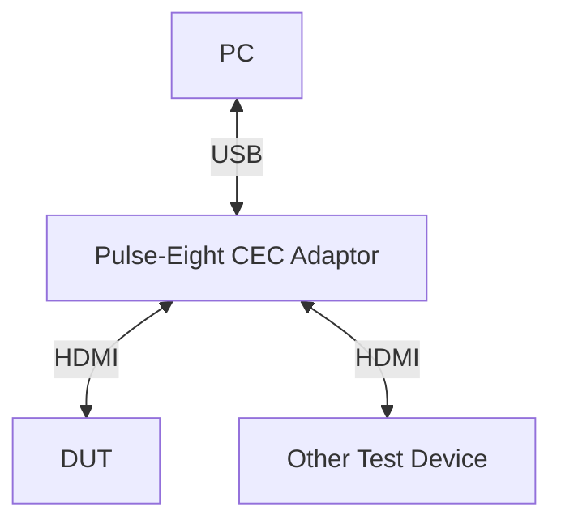

# HDMI CEC HAL L3 Python Test Procedure

## Table of Contents

- [Acronyms, Terms and Abbreviations](#acronyms-terms-and-abbreviations)
- [Setting Up Test Environment](#setting-up-test-environment)
- [Test Cases](#test-cases)
  - [hdmiCEC_L3_Runall.py](#hdmicec_l3_runallpy)
  - [hdmiCEC_test01_TransmitCECCommands.py](#hdmicec_test01_transmitceccommandspy)
  - [hdmiCEC_test02_ReceiveCECCommands.py](#hdmicec_test02_receivececcommandspy)

## Acronyms, Terms and Abbreviations

- `HAL`    - Hardware Abstraction Layer
- `L3`     - Level 3 Testing
- `DUT`    - Device Under Test
- `RAFT`   - Rapid Automation Framework for Testing
- `YAML`   - YAML Ain't Markup Language
- `HDMI`   -  High Definition Multimedia Interface
- `API`    -  Application Program Interface
- `SoC`    -  System on Chip
- `DUT`    -  Device Under Test
- `LA`     -  Logical Address
- `PA`     -  Physical Address

## Setting Up Test Environment

The picture below depicts the HDMI CEC L3 Test Functionality Setup. This simple setup has an HDMI CEC Pulse-eight USB adaptor, which acts as a source device and can send the required commands (using libcec tool commands) and respond to the received CEC Commands.

### Prerequisites

- Ensure all devices in the test setup support the `HDMI` `CEC` feature for the test duration.
- HDMI drivers must be properly installed and active on the platform before initiating the test.



### Pulse-Eight CEC Adaptor tool

The Pulse-Eight CEC adaptor is used to frame and send commands to the DUT. It utilizes the libCEC library for HDMI CEC activities, and the cec-client tool plays a key role in test automation within RAFT.

- Adaptor Details: [Pulse Eight](https://www.pulse-eight.com/p/104/usb-hdmi-cec-adapter)

#### Installation Instructions

- Linux

```bash
sudo apt update
sudo apt upgrade
sudo apt install cec-utils
```

- Windows

Download the [libcec Tool](https://www.pulse-eight.com/Download/Get/51) and follow installation steps.

#### Example `cec-client` Commands

- List Device Details:

```bash
cec-client -l
```

- Scan for Connected Devices:

```bash
echo 'scan' | cec-client -s -d 1
```

- Send CEC Commands:

```bash
echo 'tx 10:8F' | cec-client -s -d 1

Command Format:
tx <source Logical address><Destination logical Address>:<Opcode>:<Payload bytes>
```

### Python Environment

To execute `HAL` `L3` Python test cases, need a Python environment. Follow these steps mentioned in [HPK Public Documentation](https://github.com/rdkcentral/rdk-hpk-documentation/blob/main/README.md)

### Update Configuration Files

#### Rack Configuration File

Example Rack configuration File: [example_rack_config.yml](https://github.com/rdkcentral/rdk-halif-test-hdmi_cec/blob/main/host/tests/configs/example_rack_config.yml)

Refer to the following resources for more details:

- [RAFT](https://github.com/rdkcentral/python_raft/blob/1.0.0/README.md)
- [example_rack_config.yml](https://github.com/rdkcentral/python_raft/blob/1.0.0/examples/configs/example_rack_config.yml)

Update the configuration to define the console sessions for the DUT, cec-client details, and outbound settings.

##### Console Sessions

|Console Session|Description|
|---------------|-----------|
|default|Downloads the bins required for test cases|
|ssh_hal_test|Executes the `HAL` binary for the test case|

##### CEC Controller

`RAFT` supports two types of cec controllers:

###### Remote controller

For adaptors connected to a remote server, use the configuration below:

```yaml
      hdmiCECController:
        type: remote-cec-client    # Use remote cec controller
        adaptor: /dev/ttyACM0      # Adaptor port
        address: XXX.XXX.XXX.XXX   # IP address of the server
        username: root             # Login username
        password: ' '              # Login password
```

###### Local controller

For adaptors connected directly to the server running the tests, use the configuration below:

```yaml
      hdmiCECController:
        type: cec-client           # Use local cec controller
        adaptor: /dev/ttyACM0      # adaptor port
```

##### Example Rack Configuration

```yaml
rackConfig:
  - dut:
      ip: "XXX.XXX.XXX.XXX"  # IP Address of the device
      description: "stb device under test"
      platform: "stb"
      consoles:
        - default:
            type: "ssh"
            port: 10022
            username: "root"
            ip: "XXX.XXX.XXX" # IP address of the device
            password: ' '
        - ssh_hal_test:
            type: "ssh"
            port: 10022
            username: "root"
            ip: "XXX.XXX.XXX" # IP address of the device
            password: ' '
      outbound:
        download_url: "http://localhost:8000/"    # download location for the CPE device
        httpProxy:   # Local Proxy if required
        workspaceDirectory: './logs/workspace'   # Local working directory
      hdmiCECController:
        type: remote-cec-client
        adaptor: /dev/ttyACM0
        address: XXX.XXX.XXX.XXX
        username: root
        password: ' '
```

#### Device Configuration File

Example Device configuration File: [deviceConfig.yml](https://github.com/rdkcentral/rdk-halif-test-hdmi_cec/blob/main/host/tests/configs/deviceConfig.yml)

Refer to the following resources for more details:

- [RAFT](https://github.com/rdkcentral/python_raft/blob/1.0.0/README.md)
- [example_device_config.yml](https://github.com/rdkcentral/python_raft/blob/1.0.0/examples/configs/example_device_config.yml)

Update the following fields:

- **Target Directory**: Specify the `target_directory` path where HAL binaries will be copied.
- **Device Profile**: Provide the path and profile file for the `test/profile`.
- **Platform**: Ensure the platform matches the `dut` platform in the [Rack Configuration](#rack-configuration-file)

```yaml
deviceConfig:
    cpe1:
        platform: "tv"
        model: "uk"
        soc_vendor: "soc"
        target_directory: "/tmp/"  # Target Directory on device
        prompt: ""
        test:
            profile: "../../../profiles/sink/sink_hdmiCEC.yml"
```

#### Test Configuration

Example Test Setup configuration File: [hdmiCEC_testConfig.yml](https://github.com/rdkcentral/rdk-halif-test-hdmi_cec/blob/main/host/tests/classes/hdmiCEC_testConfig.yml)

Specify the command to run the HAL binary within this file.

```yaml
hdmicec:
    description: "hdmi CEC testing profile / menu system for UT"
    test:
        artifacts:
        #List of artifacts folders, test class copies the content of folder to the target device workspace
          - "../../../bin/"
        # exectute command, this will appended with the target device workspace path
        execute: "run.sh"
        type: UT-C # C (UT-C Cunit) / C++ (UT-G (g++ ut-core gtest backend))
```

## Run Test Cases

Once the environment is set up, you can execute the test cases with the following command

```bash
python <TestCaseName.py> --config </PATH>/ut/host/tests/configs/example_rack_config.yml --deviceConfig </PATH>/ut/host/tests/configs/deviceConfig.yml
```

## Test Cases

### hdmiCEC_L3_Runall.py

This python file runs all the tests

```bash
python hdmiCEC_L3_Runall.py --config </PATH>/ut/host/tests/configs/example_rack_config.yml --deviceConfig </PATH>/ut/host/tests/configs/deviceConfig.yml
```

### hdmiCEC_test01_TransmitCECCommands.py

#### Platform Support - test01

- Source
- Sink

#### User Input Required - test01

No - (This is a automated case)

#### Acceptance Criteria - test01

- The test verifies that the device under test (DUT) can successfully transmit HDMI-CEC commands to connected devices as defined in the test profile.
- Transmission should be correctly initiated and logged by the HDMI-CEC controller.

#### Expected Results - test01

The test is considered successful if:

- All HDMI-CEC commands listed in the `YAML` profile are transmitted without errors.
- The test script validates that the transmission is initiated and logged correctly by the HDMI-CEC controller.

#### Test Steps - test01

Preparation:

- Ensure the `DUT` is connected to the HDMI-CEC controller devices via HDMI cables.
- Verify that configuration files for the test environment are correctly set up.

Execution:

Run the Python script with the following command:

```bash
python hdmiCEC_test01_TransmitCECCommands.py --config </PATH>/ut/host/tests/configs/example_rack_config.yml --deviceConfig </PATH>/ut/host/tests/configs/deviceConfig.yml
```

Functionality:

- The script initializes the HDMI-CEC controller session.
- It transmits HDMI-CEC commands from the DUT to the connected devices.

Validation:

- The script checks if the HDMI-CEC controller logs confirm the transmission of each command.
- Transmission status is logged with details such as source, destination, opcode, and payload.

#### Test Logs and Artifacts - test01

Summary Logs:

- A comprehensive log file is generated, detailing the execution status of each command.
- Log file path: <"PATH">/ut/logs/rack<#>/slot<#>/<"DATE-TIME">/test_summary.log.

- Transmission Status:
  - Logs include information about the success or failure of each transmitted command.

#### Test Conclusion - test01

The test script will display a final PASS/FAIL result based on the following conditions:

- PASS: All CEC commands are successfully transmitted as listed in the YAML profile, and transmission logs confirm initiation by the HDMI-CEC controller.
- FAIL: Any transmission error or failure to initiate commands.

Summary logs are saved for further review and debugging.

### hdmiCEC_test02_ReceiveCECCommands.py

#### Platform Support - test02

- Source
- Sink

#### User Input Required - test02

No -  (This is a automated case)

#### Acceptance Criteria - test02

- The test verifies whether the device under test (DUT) can reliably receive HDMI-CEC commands.
- The received callback data must match the expected values, including:
  - Source logical address
  - Destination logical address
  - Opcode
  - Payload

#### Expected Results - test02

The test is considered successful if:

- All transmitted HDMI-CEC commands are successfully received by the DUT.
- The callback data accurately reflects the transmitted command parameters (source, destination, opcode, and payload).

#### Test Steps - test02

Preparation:

- Ensure the DUT is powered on and connected to the HDMI-CEC controller.
- Verify the configuration files for the test environment are properly set up.

Execution:

Run the Python script with the following command:

```bash
python hdmiCEC_test02_ReceiveCECCommands.py --config </PATH>/ut/host/tests/configs/example_rack_config.yml --deviceConfig </PATH>/ut/host/tests/configs/deviceConfig.yml
```

Functionality:

- The script initializes the HDMI-CEC controller.
- It sends HDMI-CEC commands to the DUT's logical address, including directed and broadcast messages.
- The DUT processes these commands, and the script reads the callback data.

Verification:

- The script validates the callback data received by the DUT against the transmitted parameters (source, destination, opcode, payload).

#### Test Logs and Artifacts - test02

Summary Logs:

- The script generates a detailed log file summarizing the test execution.
- Log file path: <"PATH">/ut/logs/rack<#>/slot<#>/<"DATE-TIME">/test_summary.log
- Logs include information on received commands, validation results, and any discrepancies.

#### Test Conclusion - test02

The test script will display a final PASS/FAIL result based on the following conditions:

- PASS: All received HDMI-CEC commands and callback data match the expected values.
- FAIL: Any mismatch in the callback data or failure to receive commands.

Summary logs are saved for review and troubleshooting
