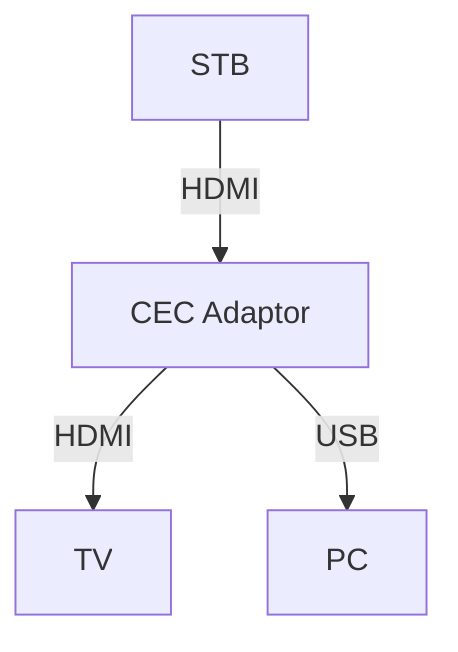

# HDMI CEC L3 Test Document for Sink Devices.

## Table of Contents
- [Acronyms, Terms and Abbreviations](#acronyms-terms-and-abbreviations)
- [Description](#description)
- [Component Runtime Execution Requirements](#component-runtime-execution-requirements)
  - [Initialization and Startup]

## Overview
This document provides an overview of the L3 testing requirements for the module `HDMI CEC` source device. It outlines the scope of testing, objectives, External devices, specific test requirements,  expected deliverables and approaches to satisfy the L3 Test requirement.  

## Acronyms, Terms and Abbreviations
- `CEC`    -  Consumer Electronics Control
- `HAL`    -  Hardware Abstraction layer
- `HDMI`  -  High Definition Multimedia Interface
- `API`    -  Application Program Interface
- `SoC`    -  System on Chip
- `DUT`    -  Device Under Test.

## References
CEC Adaptor: https://www.pulse-eight.com/p/104/usb-hdmi-cec-adapter#
`HAL` interface file: https://github.com/rdkcentral/rdk-halif-hdmi_cec/blob/main/include/hdmi_cec_driver.h

## Module Description
Consumer Electronics Control (`CEC`) is a one-wire bidirectional bus within an HDMI system that enables interconnected products to communicate. This module outlines a set of `HAL` `APIs` designed to support `HDMI` `CEC` functionality. The current document details the L3 test definitions and descriptions used to validate these `HDMI` `CEC` `APIs`, including the prerequisites that must be managed before testing and the external stimuli that need to be applied during the test.

The present document describes the test scope for the Sink Device activities only.

### HDMI-CEC L3 Test Functionality
The below pic depicts the HDMI CEC L3 Test Functionality Setup.  TV 2 marked as `DUT` is the Sink device under test.

Note: All the devices used in the test setup should support `HDMI` `CEC` feature during the entire test duration.

### Pulse-8 CEC Adaptor tool:
The Pulse-8 CEC Adapter will be utilized to frame and send commands to the DUT. This tool leverages libcec, which can be installed to facilitate CEC activities during testing. The cec-client tool will be employed extensively throughout the test. Additionally, RAFT can use this tool to automate the test cases.

Reference to the tool: https://www.pulse-eight.com/p/104/usb-hdmi-cec-adapter
libcec tools: https://www.pulse-eight.com/Download/Get/51  

**Commands used during the test:**
To get the COM port of the `CEC` Tool adaptor: cec-client -l
To find the devices connected (with their logical and physical address): echo scan | cec-client <Port> -s -d 1
To Tx and Broadcast: echo tx <frames> | cec-client <Port> -s -d 1

#### Logical Address Test
1. Setting the logical address for the `DUT` with the same logical address of the already existing device on the network (STB)

#### Message Transmission and Reception Test
2. Transmitting HDMI CEC Command to receive a reply.
3. Broadcasting a HDMI CEC Command to put the STB into Standby state.  
4. Recieve a standby broadcasting command sent by the CEC Adaptor
5. Receiving an HDMI OSD Command with a string of max length (14 bytes ) from CEC Adaptor.

#### Stress Test
6. Receiving an HDMI OSD Command repeatedly for 10 times with a string of max length from CEC Adaptor.

#### Hardware Fault Test
7. Introducing a Fault on the HDMI line to test the Transmit functionality.

# Test 1: Logical Address Test

### Functionality: 
1. The `DUT` should attempt to acquire a logical address that is already in use.

### Pre-requisites:
1. First, set the STB to ON state to enable it to acquire a Logical address.
2. HDMI CEC Adaptor should be able to help in getting the STB logical address for further activities.

|Title|Details|
|--|--|
|Function Name|`test_l3_hdmi_cec_sink_hal_AcquireLogicalAddress`|
|Description|This function performs to acquire a Logical address that is already acquired by the STB. This should prove the capability of the HAL API HdmiCecAddLogicalAddress() where it shall fail to acquire a Logical address that is already been taken |
|Test Group|03|
|Test Case ID|001|
|Priority|High|

**Pre-Conditions:**
1. An STB device should be present in the network which is already acquired the Logical A before the test is performed.
2. The HMDI CEC Adaptor should provide a way to read the acquired STB logical address.

**Dependencies:**
Prerequisites should be met before starting this test.

**User Interaction:**
The user should be able to get the STB logical address and feed it for the test.
`echo scan | cec-client <Port> -s -d 1` shall be used to get the logical address of all the devices connected on the network. 

#### Test Procedure
| Variation / Steps | Description | Test Data | Expected Result | Notes|
| -- | --------- | ---------- | -------------- | ----- |
| 01 | Open HDMI CEC HAL using HdmiCecOpen API | handle = valid pointer | HDMI_CEC_IO_SUCCESS | Should be successful |
| 02 | Wait to enter the STB logical address | NA | NA | Feed the logical Address of the STB manually |
| 03 | Try acquiring the STB logical address using HdmiCecAddLogicalAddress()| handle = valid handle, logicalAddress = STB logical address | HDMI_CEC_IO_LOGICALADDRESS_UNAVAILABLE | Should be successful |
| 04 | Close HDMI CEC HAL using HdmiCecClose API | handle = valid handle | HDMI_CEC_IO_SUCCESS | Should be successful |

# Test 2: Request, Receive, and Respond to the basic CEC Commands 

Functionality: 
1. `DUT` shall request a CEC Version from the Source Device (STB).  It should receive a valid version and be evaluated.
2. `DUT` shall receive a standby command as a unicast command from the CEC Adaptor.
3. `DUT` shall receive an OSD Command with max buffer size from the CEC Adaptor and respond to this command.

| Title                         | Details                                          |
|-------------------------------|--------------------------------------------------|
| Function Name                 | `test_l3_hdmi_cec_sink_tx_rx_test`              |
| Description                   | This test shall validate the Tx, and Rx CEC Commands between the `DUT`, STB, and CEC Adaptor connected on a network |
| Test Group                    | 03                                               |
| Test Case ID                  | 002                                              |
| Priority                      | High                                             |

**Pre-Conditions:**
The platforms are connected as shown in the picture above and STB and the CEC Adaptor are kept ready before the start of the test.

**Dependencies:**
Prerequisites should be met before starting this test.

**User Interaction:**
If the user chooses to run the test in interactive mode, then the test case has to be selected via the console.
`echo tx <frames> | cec-client <Port> -s -d 1` shall be used to Transmit the CEC Frames from `HDMI` `CEC` Adaptor. 
RAFT can also use these commands or the Andriod libraries.

#### Test Procedure 

| Variation / Steps | Description | Test Data | Expected Result | Notes |
| -- | --------- | ---------- | -------------- | ----- |
| 01 | Open HDMI CEC HAL using `HdmiCecOpen` API | `handle` = valid pointer | `HDMI_CEC_IO_SUCCESS` | Should be successful |
| 02 | Acquire a valid logical address `0x00` using `HdmiCecAddLogicalAddress` | `handle` = valid handle, `logicalAddress` = 0 | `HDMI_CEC_IO_SUCCESS` | Should be successful |
| 03 | Set the receive callback function using `HdmiCecSetRxCallback` | `handle` = valid handle, `cbfunc` = RxCallback, `data` = buffer pointer | `HDMI_CEC_IO_SUCCESS` | Should be successful |
| 04 | Get the connected device (STB) logical address manually. Wait until this data is entered | N/A | N/A | Enter the logical address of the STB as read on the CEC adapter |
| 05 | Frame a command to transmit CEC frames to get the CEC version of the connected STB using `HdmiCecTx` | `handle` = valid handle, `buf` = {0x47, 0x9F}, `len` = sizeof(buf), `result` = valid pointer | `HDMI_CEC_IO_SUCCESS` | Should be successful |
| 06 | Wait for a second and validate a response from the STB on the RxCallback and set the `dataRx` flag to True. Validate the received data and set the `dataRx` flag to False | Test data received from STB | Read and validate this data. Rx data should be a valid CEC version | Should be successful |
| 12 | Frame and send a CEC OSD command with full buffer data with `DUT` logical address from CEC adapter | `buffer` = {0x02, 0x64, "Hello, World!"} | N/A | User to set this data through CEC adapter |
| 13 | Wait for the user to signal when the CEC command is sent in step 12 | User to press `y` to move | N/A | User to signal once the CEC command is sent |
| 14 | Wait for a second to receive data from the CEC adapter on the RxCallback and set the `dataRx` flag to True. Validate the received data with "Hello, World!" and set the `dataRx` flag to False | Test data received should be `0x0F` | Read and validate this data. Data received should be "Hello, World!" | Should be successful |
| 15 | Close HDMI CEC HAL using `HdmiCecClose` API | `handle` = valid handle | `HDMI_CEC_IO_SUCCESS` | Should be successful |

# Test 3: Transmit and Receive CEC broadcast Commands 

Functionality: 
1. `DUT` shall broadcast a standby command to the connected devices and STB should receive and act upon the command. 
2. `DUT` shall receive a standby command as a broadcast command from the CEC Adaptor.

| Title                         | Details                                          |
|-------------------------------|--------------------------------------------------|
| Function Name                 | `test_l3_hdmi_cec_sink_broadcast_test`              |
| Description                   | This test shall validate the broadcast CEC Commands between the `DUT`, STB, and CEC Adaptor connected on a network |
| Test Group                    | 03                                               |
| Test Case ID                  | 003                                              |
| Priority                      | High                                             |

**Pre-Conditions:**
The platforms are connected as shown in the picture above and STB and the CEC Adaptor are kept ready before the start of the test.

**Dependencies:**
Prerequisites should be met before starting this test.

**User Interaction:**
If the user chooses to run the test in interactive mode, then the test case has to be selected via the console.
`echo tx <frames> | cec-client <Port> -s -d 1` shall be used to Broadcast the CEC Frames from `HDMI` `CEC` Adaptor. 
RAFT can also use these commands or the Andriod libraries.

#### Test Procedure 
## New Test Plan (Broadcast Commands)

| Variation / Steps | Description | Test Data | Expected Result | Notes |
| -- | --------- | ---------- | -------------- | ----- |
| 01 | Open HDMI CEC HAL using `HdmiCecOpen` API | `handle` = valid pointer | `HDMI_CEC_IO_SUCCESS` | Should be successful |
| 02 | Acquire a valid logical address `0x00` using `HdmiCecAddLogicalAddress` | `handle` = valid handle, `logicalAddress` = 0 | `HDMI_CEC_IO_SUCCESS` | Should be successful |
| 03 | Set the receive callback function using `HdmiCecSetRxCallback` | `handle` = valid handle, `cbfunc` = RxCallback, `data` = buffer pointer | `HDMI_CEC_IO_SUCCESS` | Should be successful |
| 04 | Frame a command to broadcast CEC frames to put the connected STB into standby state using `HdmiCecTx` | `handle` = valid handle, `buf` = {0x0F, 0x36}, `len` = sizeof(buf), `result` = valid pointer | `HDMI_CEC_IO_SUCCESS` | Should be successful. Buffer data may change based on STB logical address |
| 05 | Wait for the user to respond indicating test pass or fail | `1` for pass and `0` for fail | N/A | User to enter the result |
| 06 | Frame and send a CEC command to broadcast standby command from CEC adapter | `buffer` = {0x2F, 0x36} | N/A | User to set this data through CEC adapter |
| 07 | Wait for the user to signal when the CEC broadcast is sent in step 6 | User to press `y` to move | N/A | User to signal once the CEC broadcast is set |
| 08 | Wait for a second to receive data from the CEC adapter on the RxCallback and set the `dataRx` flag to True. Validate the received data with `0x36` and set the `dataRx` flag to False | Test data received should be `0x0F` | Read and validate this data. Data received should be `0x36` (standby data) | Should be successful |
| 09 | Close HDMI CEC HAL using `HdmiCecClose` API | `handle` = valid handle | `HDMI_CEC_IO_SUCCESS` | Should be successful |

# Test 4: Stress Test

Functionality: 
1. `DUT` shall respond to a CEC OSD command received from the CEC Adaptor repeatedly for 10 times.  The adaptor will be used for better control from the automation tool.

| Title                         | Details                                          |
|-------------------------------|--------------------------------------------------|
| Function Name                 | `test_l3_hdmi_cec_sink_respond_osd_command_from_adaptor_repeatedly`              |
| Description                   | Receive and respond to the CEC OSD Command with buffer data continuously for 10 times to prove the robustness of this API.                       |
| Test Group                    | 03                                               |
| Test Case ID                  | 004                                              |
| Priority                      | High                                             |

**Pre-Conditions:**
TV 1 and the STB are already ON before the start of the Test and they have acquired the physical and logical addresses. TV1 and STB should be good enough to support the basic CEC Commands like getting the `CEC` Version. 

**Dependencies:**
Prerequisites should be met before starting this test.

**User Interaction:**
If the user chooses to run the test in interactive mode, then the test case has to be selected via the console.
`echo tx <frames> | cec-client <Port> -s -d 1` shall be used to Broadcast the CEC Frames from `HDMI` `CEC` Adaptor. 
RAFT can also use these commands or the Andriod libraries.

#### Test Procedure
| Variation / Steps | Description | Test Data | Expected Result | Notes |
|-------------------|-------------|-----------|------------------|-------|
| 01 | Open HDMI CEC HAL using `HdmiCecOpen` API | `handle` = valid pointer | `HDMI_CEC_IO_SUCCESS` | Should be successful |
| 02 | Acquire a valid logical address `0x00` using `HdmiCecAddLogicalAddress` | `handle` = valid handle, `logicalAddress` = 0 | `HDMI_CEC_IO_SUCCESS` | Should be successful |
| 03 | Set the receive callback function using `HdmiCecSetRxCallback` | `handle` = valid handle, `cbfunc` = valid callback function pointer, `data` = pointer to the valid data buffer | `HDMI_CEC_IO_SUCCESS` | Should be successful |
| 04 | Wait for a manual command so that CEC Adaptor can send a CEC OSD Command continuously 10 times | N/A | N/A | Should be successful |
| 05 | Frame command to Tx Test OSD CEC command with full buffer size from the HDMI CEC adaptor continuously for 10 times | `buf` = {0x05, 0x64, 0x00, 0x48, 0x65, 0x6C, 0x6C, 0x6F, 0x20, 0x57, 0x6F, 0x72, 0x6C, 0x64, 0x21} | N/A | Should be successful |
| 06 | Validate the data received from the DUT when the `dataRx` flag in RxCall back function is set to true for 10 times | Compare the received data with predefined buffer | `buf` = {0x05, 0x64, 0x00, 0x48, 0x65, 0x6C, 0x6C, 0x6F, 0x20, 0x57, 0x6F, 0x72, 0x6C, 0x64, 0x21} | Should be successful |
| 07 | Close HDMI CEC HAL using `HdmiCecClose` API | `handle` = valid handle | `HDMI_CEC_IO_SUCCESS` | Should be successful |

# Test 5: Hardware Fault Test

Functionality: 
1. `DUT` shall respond with the correct error code when a Fault (pulling the HDMI line to high) is introduced into the HDMI CEC line.

| Title                         | Details                                          |
|-------------------------------|--------------------------------------------------|
| Function Name                 | `test_l3_hdmi_cec_sink_hw_fault_test`            |
| Description                   | Test for the return of proper error code when a hardware fault is introduced into the CEC line and try to Tx the CEC data.                       |
| Test Group                    | 03                                               |
| Test Case ID                  | 005                                              |
| Priority                      | High                                             |

**Pre-Conditions:**
Connect an HW fault inducer which can pull the HDMI CEC line to high and to normal through a switch.

**Dependencies:**
Prerequisites should be met before starting this test.

**User Interaction:**
If the user chooses to run the test in interactive mode, then the test case has to be selected via the console.

#### Test Procedure
| Variation / Steps | Description | Test Data | Expected Result | Notes |
|-------------------|-------------|-----------|------------------|-------|
| 01 | Open HDMI CEC HAL using `HdmiCecOpen` API | `handle` = valid pointer | `HDMI_CEC_IO_SUCCESS` | Should be successful |
| 02 | Acquire a valid logical address `0x00` using `HdmiCecAddLogicalAddress` | `handle` = valid handle, `logicalAddress` = 0 | `HDMI_CEC_IO_SUCCESS` | Should be successful |
| 03 | Set the receive callback function using `HdmiCecSetRxCallback` | `handle` = valid handle, `cbfunc` = valid callback function pointer, `data` = pointer to the valid data buffer | `HDMI_CEC_IO_SUCCESS` | Should be successful |
| 04 | Wait for a manual command so that the user is ready to pull the `HDMI` `CEC` high with the help of the fault inducer switch | N/A | N/A | Should be successful |
| 05 | Frame command to Tx Test OSD CEC command with full buffer size from the `DUT`  continuously for 10 times | handle= valid handle, `buf` = {0x05, 0x64, 0x00, 0x48, 0x65, 0x6C, 0x6C, 0x6F, 0x20, 0x57, 0x6F, 0x72, 0x6C, 0x64, 0x21} |HDMI_CEC_STATUS and HDMI_CEC_IO_SENT_FAILED | Should be successful |
| 06 | Close HDMI CEC HAL using `HdmiCecClose` API | `handle` = valid handle | `HDMI_CEC_IO_SUCCESS` | Should be successful |
