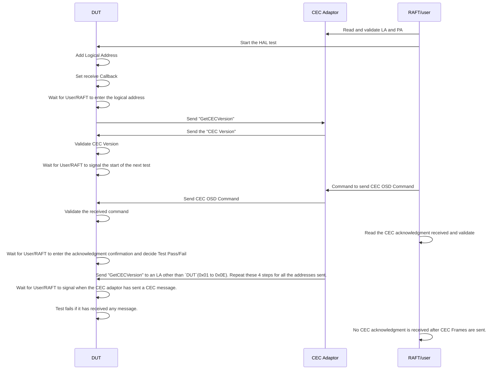
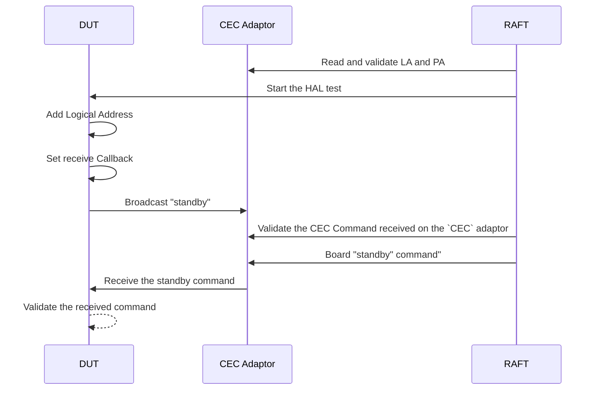
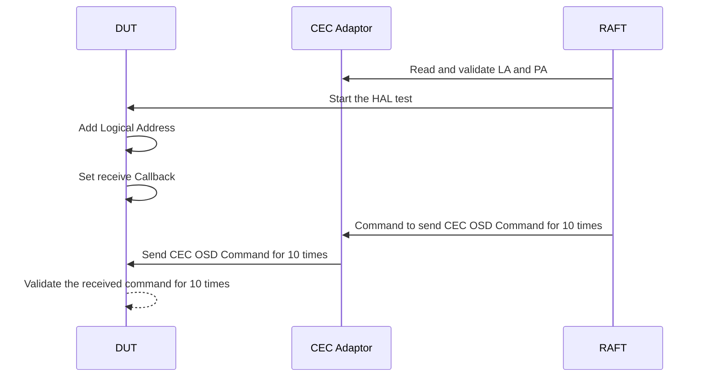

# HDMI CEC L3 Test Document for Sink Devices.

## Table of Contents
- [Acronyms, Terms and Abbreviations](#acronyms-terms-and-abbreviations)
- [Description](#description)
- [Component Runtime Execution Requirements](#component-runtime-execution-requirements)
  - [Initialization and Startup]

## Overview
This document provides an overview of the L3 testing requirements for the module `HDMI CEC` source device. It outlines the scope of testing, objectives, External devices, specific test requirements,  expected deliverables, and approaches to satisfy the L3 Test requirement.  

## Acronyms, Terms and Abbreviations
- `CEC`    -  Consumer Electronics Control
- `HAL`    -  Hardware Abstraction layer
- `HDMI`   -  High Definition Multimedia Interface
- `API`    -  Application Program Interface
- `SoC`    -  System on Chip
- `DUT`    -  Device Under Test
- `LA`     -  Logical Address 
- `PA`     -  Physical Address

## References
- CEC Adaptor: https://www.pulse-eight.com/p/104/usb-hdmi-cec-adapter#
- `HAL` interface file: https://github.com/rdkcentral/rdk-halif-hdmi_cec/blob/main/include/hdmi_cec_driver.h

## Module Description
Consumer Electronics Control (`CEC`) is a one-wire bidirectional bus within an HDMI system that enables interconnected products to communicate. This module outlines a set of `HAL` `APIs` designed to support `HDMI` `CEC` functionality. The current document details the L3 test definitions and descriptions used to validate these `HDMI` `CEC` `APIs`, including the prerequisites that must be managed before testing and the external stimuli that need to be applied during the test.

The present document describes the test scope for the Sink Device activities only.

### HDMI-CEC L3 Test Functionality
The picture below depicts the HDMI CEC L3 Test Functionality Setup. This simple setup has an HDMI CEC Pulse-eight USB adaptor, which acts as a source device and can send the required commands (using libcec tool commands) and respond to the received CEC Commands.  

Note: The below-shown prerequisites should be met before starting the test on the platforms. 
- All the devices used in the test setup should support the `HDMI` `CEC` feature during the entire test duration.
- HDMI drivers should be up and running on the platform before running this test.
- For now, it is suggested not to connect multiple CEC Adaptors onto a single PC as there is no proper support on libcec for multiple devices.

### Pulse-Eight CEC Adaptor tool:
The Pulse-Eight CEC Adapter will be used to frame and send commands to the DUT. This tool leverages libcec, which can be installed to facilitate CEC activities during testing. The cec-client tool will be employed extensively throughout the test. Additionally, RAFT can use this tool to automate the test cases.

- Reference to the tool: https://www.pulse-eight.com/p/104/usb-hdmi-cec-adapter
- libcec tools: https://www.pulse-eight.com/Download/Get/51  

**Libraries and tools required for RAFT**
- libcec should be installed on the PC where the Pulse-Eight CEC Adaptor is connected.
- python-cec will be used to control the `CEC` adaptor.
- https://pypi.org/project/cec/ will provide more information on how to use this library.
  
**cec-ctrl Commands used in Manual Mode**
- To get the logical and physical address: cec-client -s -d 4
- To Tx data: `cec-client -s -t 1 --data <command>` or `echo "tx <data>" | cec-client -s` Eg:`echo "tx 10:36" | cec-client -s`
- To check the last received data use `cec-client -m | grep '>>' | tail -n 1`.  `cec-client -m` shall monitor the data continuously 
  
**Prerequisite Test to make sure all the CEC Adaptors are connected**
1. Make sure to read the physical address of the CEC Adaptor allocated based on the port it has been connected to, using libCEC on PC.
2. The physical and logical addresses allocated to the CEC adaptor shall be read and validated on RAFT.

## Test Functionalities

#### Message Transmission and Reception Test
Note: All the below tests should be carried out on all the available HMDI ports.
- Transmit an HDMI CEC basic command (GetCECVersion) from the DUT to receive a reply from the connected CEC Adaptor.
- Receive an HDMI OSD Command with a string of maximum length (14 bytes) from the CEC Adaptor and acknowledge it.
- The CEC Adaptor sends a standby command to a device to all the logical addresses other than 0x00 and 0x0f.  `DUT` should not respond to any of these commands. 

#### Message Broadcast and Receive broadcast 
Note: All the below tests should be carried out on all the available HMDI ports.
- Broadcast an HDMI CEC Command from the DUT and verify that this command has been received on the CEC Adaptor.
- Receive a standby broadcasting command on the DUT sent by the CEC Adaptor and validate it.
  
#### Stress Test
- Receiving an HDMI OSD Command repeatedly for 10 times with a different string of max length from CEC Adaptor.

#### Hardware Fault Test
- Introducing a Fault on the HDMI line to test the Transmit functionality.

# Test 1: Message Transmission and Reception Test - Unicast messages

Functionality: 
1. `DUT` shall request a CEC Version from the CEC adaptor connected.  `DUT` should receive a valid CEC version.
2. `DUT` shall receive an OSD Command with max buffer size from the CEC Adaptor and acknowledge to this command.
3. `DUT` shall receive a "getCECVersion" command with a different `LA` from 0x01 to 0x0E and should not receive any acknowledgment.  

| Title                         | Details                                          |
|-------------------------------|--------------------------------------------------|
| Function Name                 | `test_l3_hdmi_cec_sink_tx_rx_test`              |
| Description                   | This test shall validate the Tx, and Rx CEC Commands between the `DUT`and CEC Adaptor connected on a network |
| Test Group                    | 03                                               |
| Test Case ID                  | 002                                              |
| Priority                      | High                                             |

**Pre-Conditions:**
- The platforms are connected as shown in the picture where the CEC Adaptor is considered to be connected and detected correctly.
- libcec is installed on the PC where the CEC Adaptor tool is connected. libcec shall respond to all the basic CEC Commands received from `DUT`

**Dependencies:**
Prerequisites should be met before starting this test.

**User Interaction:**
- If the user chooses to run the test in interactive mode, then the test case has to be selected via the console.
- If the user chooses to run manually, he should use the cec-client commands as shown above.
- RAFT will replace the human to run the test if required, but still, the RAFT should provide an option for the user to change the HMDI ports and start the test again.
- The user should choose either to run manually or choose the RAFT.

**RAFT Requirements:**
- RAFT shall initiate the test by reading and validating the LA and PA.
- RAFT shall initiate the commands to send the CEC OSD command with the string data as read from the hdmicec_sinktest.yml file.
- RAFT shall provide a means to enter the LA for the test and any other data required during the test. 
  
**Sequence Diagram**

#### Test Procedure 

| Variation / Steps | Description | Test Data | Expected Result | Notes |
| -- | --------- | ---------- | -------------- | ----- |
| 01 | Open HDMI CEC HAL using `HdmiCecOpen` API | `handle` = valid pointer | `HDMI_CEC_IO_SUCCESS` | Should be successful |
| 02 | Acquire a valid logical address `0x00` using `HdmiCecAddLogicalAddress` | `handle` = valid handle, `logicalAddress` = 0 | `HDMI_CEC_IO_SUCCESS` | Should be successful |
| 03 | Set the receive callback function using `HdmiCecSetRxCallback` | `handle` = valid handle, `cbfunc` = RxCallback, `data` = buffer pointer | `HDMI_CEC_IO_SUCCESS` | Should be successful |
| 04 | Wait to get the connected device (CEC Adaptor) logical address from RAFT/user.| N/A | N/A | RAFT/user to enter the LA address of the CEC Adaptor |
| 05 | Frame a getCECVersion command using the "getcecVersion" command from the test yaml file and send it using using `HdmiCecTx` | `handle` = valid handle, `buf` = cec buffer with LA and command, `len` = sizeof(buf), `result` = valid pointer | `HDMI_CEC_IO_SUCCESS` | Should be successful |
| 06 | Wait for a second and validate a response from the CEC Adaptor on the RxCallback and validate | Test data received from CEC Adaptor | Read and validate this data. Rx data should be a valid CEC version | Should be successful |
| 07 | Frame and send a CEC OSD command based on "setosd" on the test yaml file and transmit this data to `DUT`.  | `buffer` = LA, Command and data from test yaml | N/A | RAFT/user to set this data through CEC adapter |
| 08 | Wait for the RAFT/user to signal when the CEC command is sent in step 7  | NA  | N/A | RAFT/user to signal once the CEC command is sent |
| 09 | Validate the data received on `DUT` with the "setosd" command data on the test yaml file| Test data received shall match with the data in yaml | Read and validate this data| Should be successful |
| 10 | RAFT/user shall validate for the acknowledgment received from the `DUT` while the test will wait for the result| Press "Y"/"N" based on ack | Test to consume this input to decide overall test pass or fail| Should be successful |
| 11 | RAFT/user to frame and send a CEC command to all LA addresses from 0x01 to 0x0E through CEC adaptor | "getCECVersion" command  | N/A | RAFT to set this data through CEC adapter |
| 12 | RAFT/user should not receive any ack after sending this data| NA | NA | Should be successful |
| 13 | Test to wait for the RAFT/user to signal about its test result with steps 11 and 12 | Press "Y"/"N" based on test result  | N/A | RAFT/user to provide this test result |
| 14 | Close HDMI CEC HAL using `HdmiCecClose` API | `handle` = valid handle | `HDMI_CEC_IO_SUCCESS` | Should be successful |

# Test 3: Transmit and Receive CEC broadcast Commands 

Functionality: 
1. `DUT` shall broadcast a standby command to the connected devices and RAFT should validate this received command on the CEC Adaptor. 
2. `DUT` shall receive a standby command as a broadcast command from the CEC Adaptor. RAFT to initiate and command the Test.

| Title                         | Details                                          |
|-------------------------------|--------------------------------------------------|
| Function Name                 | `test_l3_hdmi_cec_sink_broadcast_test`              |
| Description                   | This test shall validate the broadcast CEC Commands between the `DUT`, and the CEC Adaptor connected on a network |
| Test Group                    | 03                                               |
| Test Case ID                  | 003                                              |
| Priority                      | High                                             |

**Pre-Conditions:**
The platforms are connected as shown in the picture above and STB and the CEC Adaptor are kept ready before the start of the test.

**Dependencies:**
Prerequisites should be met before starting this test.

**User Interaction:**
- If the user chooses to run the test in interactive mode, then the test case has to be selected via the console.
- RAFT will replace the human to run the test, but still, the RAFT should provide an option for the user to change the HMDI ports and start the test again.

**RAFT Requirements:**
- RAFT shall initiate the commands to broadcast the standby CEC command with the string data as read from the hdmicec_sinktest.yml file.
- RAFT provides an interface for the user to change the HMDI port and start the test again.
  
**Sequence Diagram**

#### Test Procedure 
## New Test Plan (Broadcast Commands)

| Variation / Steps | Description | Test Data | Expected Result | Notes |
| -- | --------- | ---------- | -------------- | ----- |
| 01 | Open HDMI CEC HAL using `HdmiCecOpen` API | `handle` = valid pointer | `HDMI_CEC_IO_SUCCESS` | Should be successful |
| 02 | Acquire a valid logical address `0x00` using `HdmiCecAddLogicalAddress` | `handle` = valid handle, `logicalAddress` = 0 | `HDMI_CEC_IO_SUCCESS` | Should be successful |
| 03 | Set the receive callback function using `HdmiCecSetRxCallback` | `handle` = valid handle, `cbfunc` = RxCallback, `data` = buffer pointer | `HDMI_CEC_IO_SUCCESS` | Should be successful |
| 04 | Frame a standby command to broadcast from `DUT` to all the connected devices using `HdmiCecTx`. Test command and data shall be read from test yaml | `handle` = valid handle, `buf` = as read from yaml file, `len` = sizeof(buf), `result` = valid pointer | `HDMI_CEC_IO_SUCCESS` | Should be successful|
| 05 | RAFT should receive this data and validate the command received. The test should wait for the RAFT to enter the test result based on the validation | NA| N/A | RAFT to provide the result |
| 06 | RAFT to command CEC adaptor to frame and broadcast the standby CEC command. Test data should be read from test yaml file | `buffer` = test yaml file data | N/A | RAFT to set this data through CEC adapter |
| 07 | Wait for the RAFT to signal when the CEC broadcast is sent in step 6 | RAFT to provide `y` to move | N/A | RAFT to signal once the CEC broadcast is set |
| 08 | Received data from the CEC adapter on the RxCallback shall be validated. Received data shall be validated against the test yaml file | Test data received should be as mentioned in the test yaml file | Read and validate this data | Should be successful |
| 09 | Close HDMI CEC HAL using `HdmiCecClose` API | `handle` = valid handle | `HDMI_CEC_IO_SUCCESS` | Should be successful |

# Test 4: Stress Test

Functionality: 
1. `DUT` shall respond to a CEC OSD command received from the CEC Adaptor continuously 10 times with different strings and validate.

| Title                         | Details                                          |
|-------------------------------|--------------------------------------------------|
| Function Name                 | `test_l3_hdmi_cec_sink_respond_osd_command_from_adaptor_repeatedly`              |
| Description                   | Receive and respond to the CEC OSD Command with buffer data continuously 10 times to prove the robustness of this API.                       |
| Test Group                    | 03                                               |
| Test Case ID                  | 004                                              |
| Priority                      | High                                             |

**Pre-Conditions:**
- The platforms are connected as shown in the picture above and STB and the CEC Adaptor are kept ready before the start of the test.
- libcec is installed on the PC where the PulseEight tool is connected. libcec will respond to all the basic CEC Commands received from `DUT`

**Dependencies:**
Prerequisites should be met before starting this test.

**User Interaction:**
- If the user chooses to run the test in interactive mode, then the test case has to be selected via the console.
- RAFT will replace the human to run the test, but still, the RAFT should provide an option for the user to change the HMDI ports and start the test again.

**RAFT Requirements:**
- RAFT shall initiate the test by reading and validating the LA and PA.
- RAFT shall initiate the commands to send the CEC OSD command with the string data as read from the hdmicec_sinktest.yml file.
  
**Sequence Diagram**

#### Test Procedure
| Variation / Steps | Description | Test Data | Expected Result | Notes |
|-------------------|-------------|-----------|------------------|-------|
| 01 | Open HDMI CEC HAL using `HdmiCecOpen` API | `handle` = valid pointer | `HDMI_CEC_IO_SUCCESS` | Should be successful |
| 02 | Acquire a valid logical address `0x00` using `HdmiCecAddLogicalAddress` | `handle` = valid handle, `logicalAddress` = 0 | `HDMI_CEC_IO_SUCCESS` | Should be successful |
| 03 | Set the receive callback function using `HdmiCecSetRxCallback` | `handle` = valid handle, `cbfunc` = valid callback function pointer, `data` = pointer to the valid data buffer | `HDMI_CEC_IO_SUCCESS` | Should be successful |
| 04 | RAFT shall wait for a signal from `DUT`so that it can signal the CEC Adaptor to send a CEC OSD Command continuously 10 times with different data available in test yaml file | N/A | N/A | Should be successful |
| 05 | Validate the data received on the DUT and compare the data with the data from "setosd/data" on test yaml file  | Compare the received data with "setosd/data" on test yaml  | NA | Should be successful |
| 07 | Close HDMI CEC HAL using `HdmiCecClose` API | `handle` = valid handle | `HDMI_CEC_IO_SUCCESS` | Should be successful |

# Test 5: Hardware Fault Test

Functionality: 
1. `DUT` shall respond with the correct error code when a Fault (pulling the HDMI line to high) is introduced into the HDMI CEC line.

| Title                         | Details                                          |
|-------------------------------|--------------------------------------------------|
| Function Name                 | `test_l3_hdmi_cec_sink_hw_fault_test`            |
| Description                   | Test for the return of proper error code when a hardware fault is introduced into the CEC line and try to Tx the CEC data.                       |
| Test Group                    | 03                                               |
| Test Case ID                  | 005                                              |
| Priority                      | High                                             |

**Pre-Conditions:**
Connect an HW fault inducer which can pull the HDMI CEC line to high and to normal through a switch.

**Dependencies:**
Prerequisites should be met before starting this test.

**User Interaction:**
If the user chooses to run the test in interactive mode, then the test case has to be selected via the console.

#### Test Procedure
| Variation / Steps | Description | Test Data | Expected Result | Notes |
|-------------------|-------------|-----------|------------------|-------|
| 01 | Open HDMI CEC HAL using `HdmiCecOpen` API | `handle` = valid pointer | `HDMI_CEC_IO_SUCCESS` | Should be successful |
| 02 | Acquire a valid logical address `0x00` using `HdmiCecAddLogicalAddress` | `handle` = valid handle, `logicalAddress` = 0 | `HDMI_CEC_IO_SUCCESS` | Should be successful |
| 03 | Set the receive callback function using `HdmiCecSetRxCallback` | `handle` = valid handle, `cbfunc` = valid callback function pointer, `data` = pointer to the valid data buffer | `HDMI_CEC_IO_SUCCESS` | Should be successful |
| 04 | Wait for a manual command so that the user is ready to pull the `HDMI` `CEC` high with the help of the fault inducer switch | N/A | N/A | Should be successful |
| 05 | Frame command to Tx Test OSD CEC command with full buffer size from the `DUT`  continuously for 10 times | handle= valid handle, `buf` = {0x05, 0x64, 0x00, 0x48, 0x65, 0x6C, 0x6C, 0x6F, 0x20, 0x57, 0x6F, 0x72, 0x6C, 0x64, 0x21} |HDMI_CEC_STATUS and HDMI_CEC_IO_SENT_FAILED | Should be successful |
| 06 | Close HDMI CEC HAL using `HdmiCecClose` API | `handle` = valid handle | `HDMI_CEC_IO_SUCCESS` | Should be successful |
