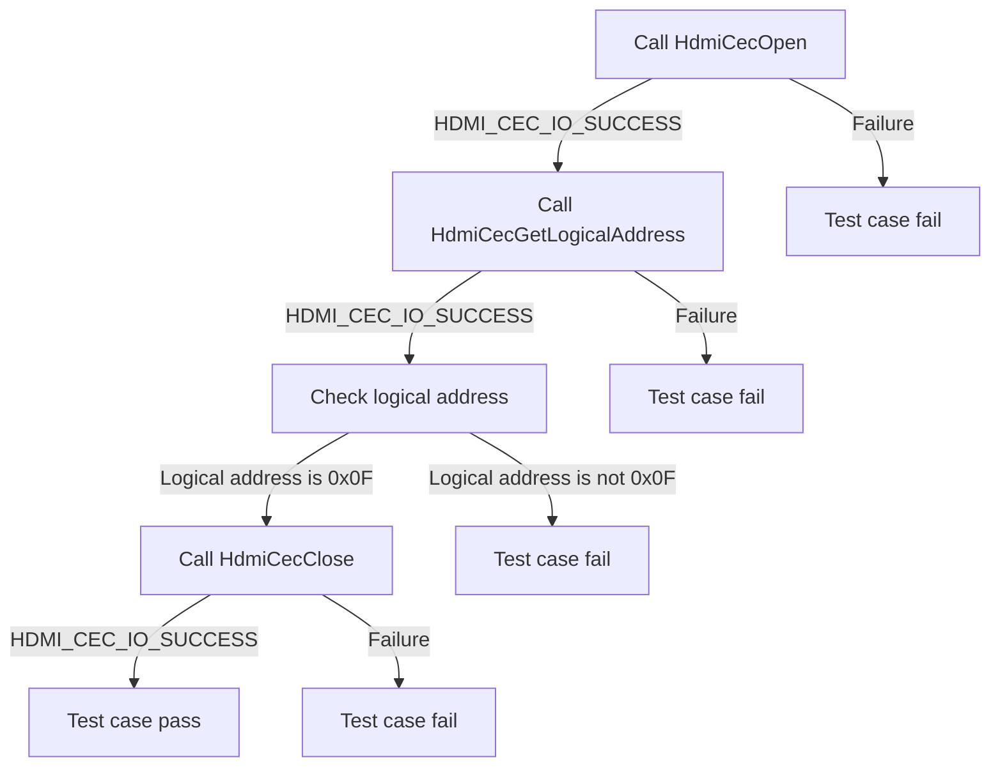
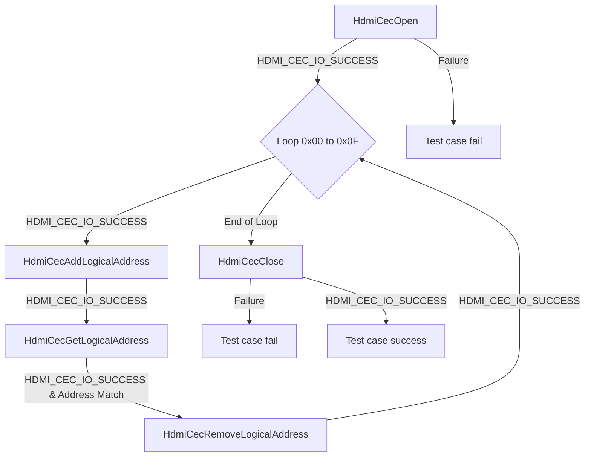
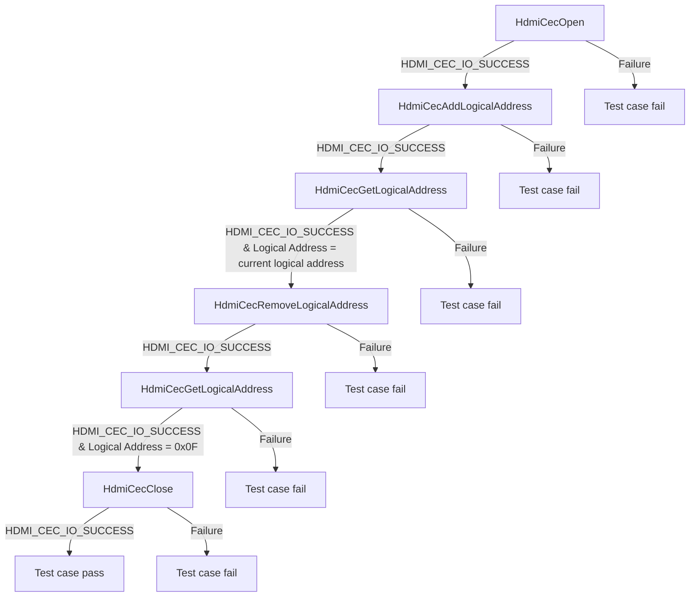
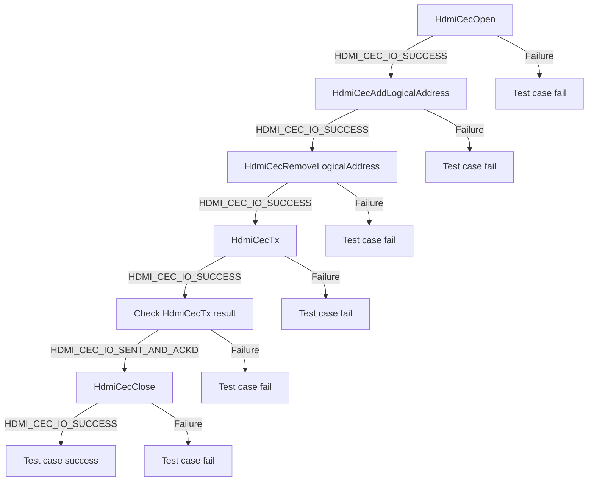
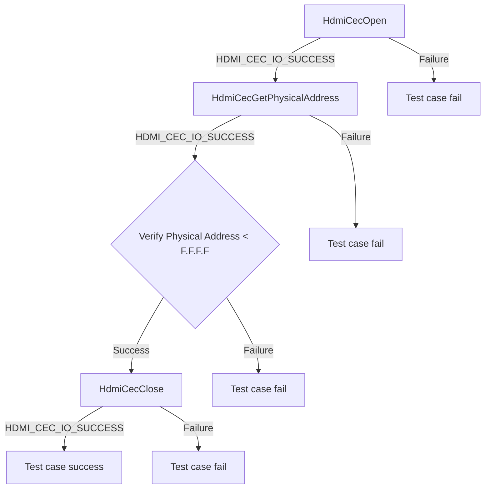
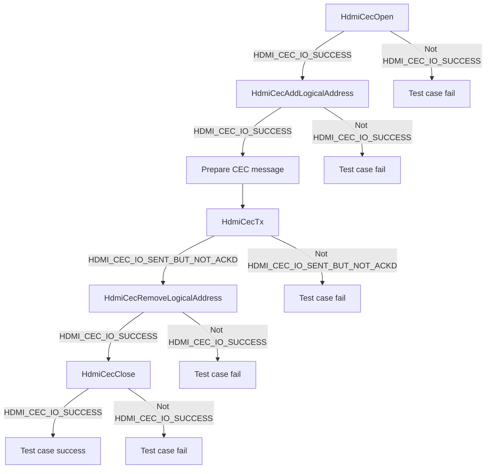

# HDMI CEC HAL L2 Low-Level Test Specification and Procedure Documentation

## Table of Contents

- [Overview](#overview)
  - [Acronyms, Terms and Abbreviations](#acronyms-terms-and-abbreviations)
  - [Definitions](#definitions)
  - [References](#references)
- [Level 2 Test Procedure](#level-2-test-procedure)

## Overview

This document describes the level 2 testing suite for the HDMI CEC HAL module.

### Acronyms, Terms and Abbreviations

- `HAL`  \- Hardware Abstraction Layer, may include some common components
- `UT`   \- Unit Test(s)
- `HDMI` \- High-Definition Multimedia Interface
- `CEC`  \- Consumer Electronics Contro  
- `DUT`  \- Device Under Test
- `API`  \- Application Program Interface

### Definitions

- `ut-core` \- Common Testing Framework <https://github.com/rdkcentral/ut-core>, which wraps an open-source framework that can be expanded to the requirements for future frameworks.

### References

- `High-Level Test Specification` - [hdmi_cec_sink_tests.md](hdmi_cec_sink_tests.md)

## Level 2 Test Procedure

The following functions are intended to test the HDMI CEC HAL module's operation on sink devices according to the L2 Test specification.

### Test 1

|Title|Details|
|--|--|
|Function Name|`test_l2_hdmi_cec_sink_hal_GetDefaultLogicalAddress`|
|Description|Get the logical address of the `DUT` without actually adding the Logical Address and the API should return 0x0F as the default logical address.|
|Test Group|02|
|Test Case ID|001|
|Priority|High|

**Pre-Conditions:**
None

**Dependencies:**
None

**User Interaction:**
If the user chooses to run the test in interactive mode, then the test case has to be selected via the console.

#### Test Procedure Test 1

| Variation / Steps | Description | Test Data | Expected Result | Notes|
| -- | --------- | ---------- | -------------- | ----- |
| 01 | Call the pre-requisite API HdmiCecOpen() | handle = 0 | HDMI_CEC_IO_SUCCESS | Should be successful |
| 02 | Call the API HdmiCecGetLogicalAddress() | handle = valid handle, logicalAddress = 0 | HDMI_CEC_IO_SUCCESS | Should be successful |
| 03 | Check the logical address |  | logicalAddress = 0x0F| Should be successful |
| 04 | Call the post-requisite API HdmiCecClose() | handle = valid handle | HDMI_CEC_IO_SUCCESS | Should be successful |

### Test 2

|Title|Details|
|--|--|
|Function Name|`test_l2_hdmi_cec_sink_hal_AddAndGetLogicalAddress`|
|Description|Setup all valid logical addresses b/w 0x00 to 0x0F for the `DUT` and retrieve each to ensure proper functionality, using HAL APIs.|
|Test Group|02|
|Test Case ID|002|
|Priority|High|

**Pre-Conditions:**
None

**Dependencies:**
None

**User Interaction:**
If the user chooses to run the test in interactive mode, then the test case has to be selected via the console.

#### Test Procedure Test 2

| Variation / Steps | Description | Test Data | Expected Result | Notes|
| -- | --------- | ---------- | -------------- | ----- |
| 01 | Open HDMI CEC HAL using HdmiCecOpen API | handle = valid pointer | HDMI_CEC_IO_SUCCESS | Should be successful |
| 02 | Loop over the range of valid logical addresses (0x00 to 0x0F) | i = 0 to 0x0F | N/A | N/A |
| 03 | Add logical address using HdmiCecAddLogicalAddress API | handle = valid handle, logicalAddress = i | HDMI_CEC_IO_SUCCESS | Should be successful |
| 04 | Retrieve logical address using HdmiCecGetLogicalAddress API | handle = valid handle, logicalAddress = valid pointer | HDMI_CEC_IO_SUCCESS, logicalAddress = i | Should be successful |
| 05 | Remove logical address using HdmiCecRemoveLogicalAddress API | handle = valid handle, logicalAddress = i | HDMI_CEC_IO_SUCCESS | Should be successful |
| 06 | Close HDMI CEC HAL using HdmiCecClose API | handle = valid handle | HDMI_CEC_IO_SUCCESS | Should be successful |

### Test 3

|Title|Details|
|--|--|
|Function Name|`test_l2_hdmi_cec_sink_hal_RemoveLogicalAddress`|
|Description|Invoke the HAL API to delete the `DUT` logical address and verify that it is removed successfully.|
|Test Group|02|
|Test Case ID|003|
|Priority|High|

**Pre-Conditions:**
None

**Dependencies:**
None

**User Interaction:**
If the user chooses to run the test in interactive mode, then the test case has to be selected via the console.

#### Test Procedure Test 3

| Variation / Steps | Description | Test Data | Expected Result | Notes|
| -- | --------- | ---------- | -------------- | ----- |
| 01 | Open the HDMI CEC HAL using HdmiCecOpen API | handle = valid handle | HDMI_CEC_IO_SUCCESS | Should be successful |
| 02 | Add a logical address using HdmiCecAddLogicalAddress API | handle = valid handle, logicalAddress = 0x00 | HDMI_CEC_IO_SUCCESS | Should be successful |
| 03 | Get the logical address using HdmiCecGetLogicalAddress API | handle = valid handle, logicalAddress = valid buffer | HDMI_CEC_IO_SUCCESS , logicalAddress = 0x00 | Should be successful |
| 04 | Remove the logical address using HdmiCecRemoveLogicalAddress API | handle = valid handle, logicalAddress = 0x00 | HDMI_CEC_IO_SUCCESS | Should be successful |
| 05 | Get the logical address using HdmiCecGetLogicalAddress API | handle = valid handle, logicalAddress = valid buffer | HDMI_CEC_IO_SUCCESS , logicalAddress = 0x0F | Should be successful |
| 06 | Close the HDMI CEC HAL using HdmiCecClose API | handle = valid handle | HDMI_CEC_IO_SUCCESS | Should be successful |

### Test 4

|Title|Details|
|--|--|
|Function Name|`test_l2_hdmi_cec_sink_hal_BroadcastHdmiCecCommand`|
|Description|After deleting the `DUT` logical address, try to send a broadcast CEC Command (as per 1.4b HDMI CEC spec) and confirm transmission is successful.|
|Test Group|02|
|Test Case ID|004|
|Priority|High|

**Pre-Conditions:**
None

**Dependencies:**
None

**User Interaction:**
If the user chooses to run the test in interactive mode, then the test case has to be selected via the console.

#### Test Procedure Test 4

| Variation / Steps | Description | Test Data | Expected Result | Notes|
| -- | --------- | ---------- | -------------- | ----- |
| 01 | Open HDMI CEC using HdmiCecOpen | handle = valid buffer | HDMI_CEC_IO_SUCCESS | Should be successful |
| 02 | Add logical address using HdmiCecAddLogicalAddress | handle = valid handle, logicalAddresses = 0x0 | HDMI_CEC_IO_SUCCESS | Should be successful |
| 03 | Remove logical address using HdmiCecRemoveLogicalAddress | handle = valid handle, logicalAddresses = 0x0 | HDMI_CEC_IO_SUCCESS | Should be successful |
| 04 | Broadast CEC message using HdmiCecTx | handle = valid handle, buf = {0x0F, 0x84, 0x00, 0x00}, len = sizeof(buf), result = valid buffer | HDMI_CEC_IO_SUCCESS | Should be successful |
| 05 | Check the result of transmission | result = valid buffer | HDMI_CEC_IO_SENT_BUT_NOT_ACKD| Should be successful |
| 06 | Close HDMI CEC using HdmiCecClose | handle = valid handle | HDMI_CEC_IO_SUCCESS | Should be successful |

### Test 5

|Title|Details|
|--|--|
|Function Name|`test_l2_hdmi_cec_sink_hal_VerifyPhysicalAddress`|
|Description|Verify the valid physical address allocated through the HAL function.|
|Test Group|02|
|Test Case ID|005|
|Priority|High|

**Pre-Conditions:**
None

**Dependencies:**
None

**User Interaction:**
If the user chooses to run the test in interactive mode, then the test case has to be selected via the console.

#### Test Procedure Test 5

| Variation / Steps | Description | Test Data | Expected Result | Notes|
| -- | --------- | ---------- | -------------- | ----- |
| 01 | Call the pre-requisite API HdmiCecOpen() | handle = valid handle | HDMI_CEC_IO_SUCCESS | Should be successful |
| 02 | Call the API HdmiCecGetPhysicalAddress() | handle = valid handle, physicalAddress = valid address | HDMI_CEC_IO_SUCCESS | Should be successful |
| 03 | Check the return status of HdmiCecGetPhysicalAddress() | status = return status of HdmiCecGetPhysicalAddress() | HDMI_CEC_IO_SUCCESS | Should be successful |
| 04 | Verify that the physical address obtained is greater than or equal to F.F.F.F | physicalAddress = obtained physical address | physicalAddress >= 0xFFFF | Should be successful |
| 05 | Call the post-requisite API HdmiCecClose() | handle = valid handle | HDMI_CEC_IO_SUCCESS | Should be successful |

### Test 6

|Title|Details|
|--|--|
|Function Name|`test_l2_hdmi_cec_sink_hal_TransmitCECCommand`|
|Description|DUT transmits a CEC Command (as per 1.4b HDMI CEC spec) to get the CEC version of the device that doesn't exist.|
|Test Group|02|
|Test Case ID|006|
|Priority|High|

**Pre-Conditions:**
None

**Dependencies:**
None

**User Interaction:**
If the user chooses to run the test in interactive mode, then the test case has to be selected via the console.

#### Test Procedure Test 6

| Variation / Steps | Description | Test Data | Expected Result | Notes|
| -- | --------- | ---------- | -------------- | ----- |
| 01 | Open HDMI CEC HAL using HdmiCecOpen | handle = valid buffer | HDMI_CEC_IO_SUCCESS | Should be successful |
| 02 | Add logical address using HdmiCecAddLogicalAddress | handle = valid handle, logicalAddresses = 0x4 | HDMI_CEC_IO_SUCCESS | Should be successful |
| 03 | Transmit CEC command using HdmiCecTx for a non existing device | handle = valid handle, buf = {0x47, 0x9F}, len = sizeof(buf), result = valid buffer | HDMI_CEC_IO_SUCCESS, result = HDMI_CEC_IO_SENT_BUT_NOT_ACKD | Should be successful |
| 04 | Remove logical address using HdmiCecRemoveLogicalAddress | handle = valid handle, logicalAddresses = 0x4 | HDMI_CEC_IO_SUCCESS | Should be successful |
| 05 | Close HDMI CEC HAL using HdmiCecClose | handle = valid handle | HDMI_CEC_IO_SUCCESS | Should be successful |

