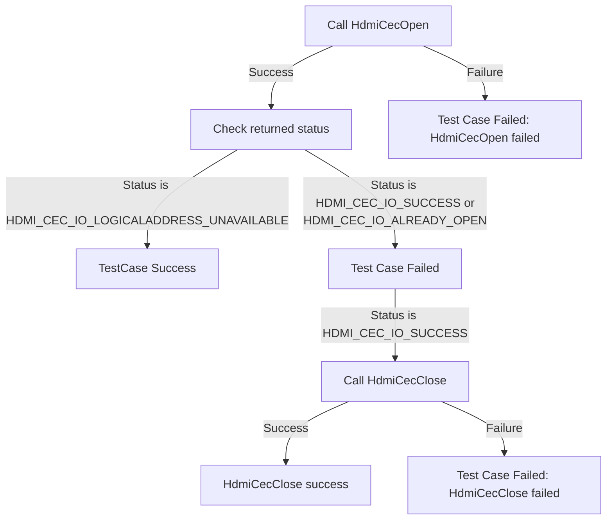

# HDMI CEC Source L2 Low Level Test Specification and Procedure Documentation

## Table of Contents

- [Overview](#overview)
  - [Acronyms, Terms and Abbreviations](#acronyms-terms-and-abbreviations)
  - [Definitions](#definitions)
  - [References](#references)
- [Level 2 Test Procedure](#level-2-test-procedure)

## Overview

This document describes the Source level 2 Low Level Test Specification and Procedure Documentation for the HDMI CEC HAL module Source.

### Acronyms, Terms and Abbreviations

- `HAL` \- Hardware Abstraction Layer, may include some common components
- `UT`  \- Unit Test(s)
- `OEM`  \- Original Equipment Manufacture
- `SoC`  \- System on a Chip

### Definitions

- `ut-core` \- Common Testing Framework <https://github.com/rdkcentral/ut-core>, which wraps a open-source framework that can be expanded to the requirements for future framework.

### References

- `High Level Test Specification` - [hdmi-cec-source_High-Level_TestSpec.md](https://github.com/rdkcentral/rdk-halif-test-hdmi_cec/blob/main/docs/pages/hdmi-cec-source_High-Level_TestSpec.md)
- `HDMI CEC HAL Interface file` - [hdmi_cec_driver.h](https://github.com/rdkcentral/rdk-halif-hdmi_cec/blob/main/include/hdmi_cec_driver.h)

## Level 2 Test Procedure

The following functions are expecting to test the module operates correctly.

### Test 1

|Title|Details|
|--|--|
|Function Name|`test_l2_hdmi_cec_source_hal_ValidateLogicalAddressUnavailability_source`|
|Description|Trying to get a logical address discovered during CEC open and validate the return value when the `DUT` is not connected to a Sink device. It should return HDMI_CEC_IO_LOGICALADDRESS_UNAVAILABLE.|
|Test Group|02|
|Test Case ID|001|
|Priority|High|

**Pre-Conditions :**
None

**Dependencies :**
None

**User Interaction :**
If user chose to run the test in interactive mode, then the test case has to be selected via console.

#### Test Procedure

| Variation / Steps | Description | Test Data | Expected Result | Notes|
| -- | --------- | ---------- | -------------- | ----- |
| 01 | Invoke HdmiCecOpen with a valid handle when the `DUT` is not connected to a Sink device | handle = valid handle | HDMI_CEC_IO_LOGICALADDRESS_UNAVAILABLE | Should be successful |
| 02 | If the status is HDMI_CEC_IO_SUCCESS, invoke HdmiCecClose with the handle | handle = valid handle | HDMI_CEC_IO_SUCCESS | Should be successful |

