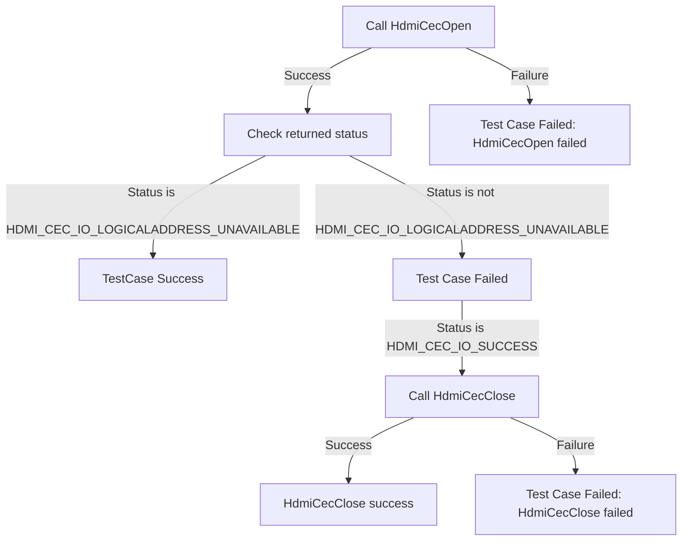

# HDMI CEC DRIVER L2 Low Level Test Specification and Procedure Documentation

## Table of Contents

- [HDMI CEC DRIVER L2 Low Level Test Specification and Procedure Documentation](#hdmi-cec-driver-l2-low-level-test-specification-and-procedure-documentation)

  - [Table of Contents](#table-of-contents)
  - [Overview](#overview)
    - [Acronyms, Terms and Abbreviations](#acronyms-terms-and-abbreviations)
    - [Definitions](#definitions)
    - [References](#references)
  - [Level 2 Test Procedure](#level-2-test-procedure)

## Overview

This document describes the level 2 testing suite for the HDMI CEC DRIVER module.

### Acronyms, Terms and Abbreviations

- `HAL` \- Hardware Abstraction Layer, may include some common components
- `UT`  \- Unit Test(s)
- `OEM`  \- Original Equipment Manufacture
- `SoC`  \- System on a Chip

### Definitions

  - `ut-core` \- Common Testing Framework <https://github.com/rdkcentral/ut-core>, which wraps a open-source framework that can be expanded to the requirements for future framework.

### References
- `High Level Test Specification` - [hdmi_cec_source_tests.md](hdmi_cec_source_tests.md)

## Level 2 Test Procedure

The following functions are expecting to test the module operates correctly.

### Test 1

|Title|Details|
|--|--|
|Function Name|`test_l2_hdmi_cec_driver_ValidateLogicalAddressUnavailability_source`|
|Description|Trying to get a logical address discovered during CEC open and validate the return value when the `DUT` is not connected to a Sink device. It should return HDMI_CEC_IO_LOGICALADDRESS_UNAVAILABLE.|
|Test Group|Module : 02|
|Test Case ID|001|
|Priority|High|

**Pre-Conditions :**
None

**Dependencies :**
None

**User Interaction :**
If user chose to run the test in interactive mode, then the test case has to be selected via console.

#### Test Procedure :

| Variation / Steps | Description | Test Data | Expected Result | Notes|
| -- | --------- | ---------- | -------------- | ----- |
| 01 | Invoke HdmiCecOpen with a valid handle when the `DUT` is not connected to a Sink device | handle = valid handle | HDMI_CEC_IO_LOGICALADDRESS_UNAVAILABLE | Should be successful |
| 02 | If the status is HDMI_CEC_IO_SUCCESS, invoke HdmiCecClose with the handle | handle = valid handle | HDMI_CEC_IO_SUCCESS | Should be successful |

