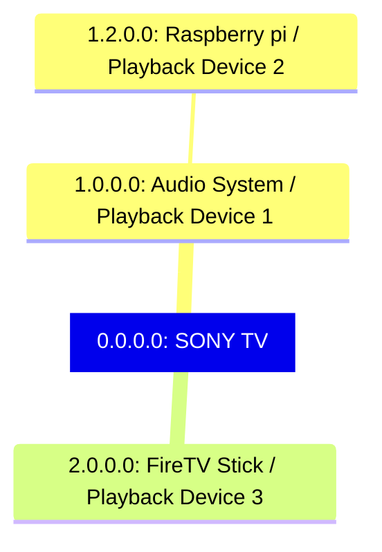

## CEC Messages captured from a real setup

This document tries to capture the cec message exchanges in an actual home setup of cec supported devices. This setup uses a Raspberry Pi 4B with Raspberry Pi OS installed.

## Setting up the RPI as a CEC monitor

To turn a Raspberry Pi into a CEC message monitor, cec-utils package can be used, which provides tools for interacting with HDMI CEC devices. Here's a step-by-step guide on how to set up and use a Raspberry Pi for this purpose:

### Step 1: Install Raspberry Pi OS

Install the latest Raspberry Pi OS on the Raspberry Pi.The OS can be downloaded from the official Raspberry Pi website.

### Step 2: Update and Upgrade the System

Open a terminal and update the system to ensure all packages are up to date:

```
sudo apt update
sudo apt upgrade
```

### Step 3: Install cec-utils

Install the cec-utils package, which includes the cec-client tool for monitoring CEC messages:

```
sudo apt install cec-utils
```

Step 4: Test CEC Communication  
Before monitoring, it's a good idea to test if the Raspberry Pi can communicate with CEC devices connected to it. Run the following command:

```
cec-client -l
```

This command lists the available CEC adapters. The output should look like:

```yaml
Found devices: 1

device:              1
com port:            RPI
vendor id:           2708
product id:          1001
firmware version:    1
type:                Raspberry Pi
```

Step 5: Start Monitoring CEC Messages  
To start monitoring CEC messages, run the following command:

```
cec-client -m -d 8
-m enables monitoring mode.
-d 8 sets the debug level to 8 (maximum verbosity).
```

The output will look similar to this when CEC messages are sent and received:

```
TRAFFIC: [         41534]     << 10:44
TRAFFIC: [         41535]     << 1f:84:10:00:00:00
TRAFFIC: [         41536]     >> 0f:87:00:e0:91
```

### Device topology

The setup contains the following devices.  
1\. Sony TV  
2\. Audio System connected to the HDMI ARC port of TV  
3\. FireTV stick connected to TV  
4\. Raspberry PI connected to the Audio System



## Setting up the RPI as a playback device

To setup the RPI as an addtional playback device, use the cec-ctl command in raspberry pi os as below.  
Refer [https://manpages.ubuntu.com/manpages/focal/en/man1/cec-ctl.1.html#:~:text=The easiest way to quickly,and show the CEC topology](https://manpages.ubuntu.com/manpages/focal/en/man1/cec-ctl.1.html#:~:text=The%20easiest%20way%20to%20quickly,and%20show%20the%20CEC%20topology).

```
 $ cec-ctl -d0 --playback -S
Driver Info:
    Driver Name                : vc4_hdmi
    Adapter Name               : vc4-hdmi-0
    Capabilities               : 0x0000011e
        Logical Addresses
        Transmit
        Passthrough
        Remote Control Support
        Connector Info
    Driver version             : 6.6.31
    Available Logical Addresses: 1
    DRM Connector Info         : card 1, connector 32
    Physical Address           : 1.2.0.0
    Logical Address Mask       : 0x0100
    CEC Version                : 2.0
    Vendor ID                  : 0x000c03 (HDMI)
    OSD Name                   : 'Playback'
    Logical Addresses          : 1 (Allow RC Passthrough)

      Logical Address          : 8 (Playback Device 2)
        Primary Device Type    : Playback
        Logical Address Type   : Playback
        All Device Types       : Playback
        RC TV Profile          : None
        Device Features        :
        None

    System Information for device 0 (TV) from device 8 (Playback Device 2):
        CEC Version                : 1.4
        Physical Address           : 0.0.0.0
        Primary Device Type        : TV
        Vendor ID                  : 0x080046 (Sony)
        OSD Name                   : 'TV'
        Menu Language              : eng
        Power Status               : On
    System Information for device 4 (Playback Device 1) from device 8 (Playback Device 2):
        CEC Version                : 1.4
        Physical Address           : 1.0.0.0
        Primary Device Type        : Playback
        Vendor ID                  : 0x080046 (Sony)
        OSD Name                   : 'SOUND SYSTEM'
        Power Status               : On
    System Information for device 5 (Audio System) from device 8 (Playback Device 2):
        CEC Version                : 1.4
        Physical Address           : 1.0.0.0
        Primary Device Type        : Audio System
        Vendor ID                  : 0x080046 (Sony)
        OSD Name                   : 'SOUND SYSTEM'
        Power Status               : On
    System Information for device 11 (Playback Device 3) from device 8 (Playback Device 2):
        CEC Version                : 1.4
        Physical Address           : 2.0.0.0
        Primary Device Type        : Playback
        Vendor ID                  : 0x000ce7 (Toshiba)
        OSD Name                   : 'Fire TV Stick'
        Power Status               : On

    Topology:

        0.0.0.0: TV
            1.0.0.0: Playback Device 1
            1.0.0.0: Audio System
                1.2.0.0: Playback Device 2
        2.0.0.0: Playback Device 3

```

## Scenario 1 - Change HDMI input

Use the TV remote to change HDMI source.

| Message Raw Payload | Sender | Receiver | CEC Command | Parameters | Intended Functionality |
| --- | --- | --- | --- | --- | --- |
| \`0f:80:10:00:20:00\` | Broadcast | TV  | Routing Change | \`10:00\` (source), \`20:00\` (destination) | Requests routing change from source at physical address \`10:00\` to \`20:00\` |
| \`0f:a0:08:00:46:00:13:00:10:00:50:50:00:00:00:00\` | Broadcast | TV  | Vendor Command With ID | \`08:00:46:00:13:00:10:00:50:50:00:00:00:00\` | Vendor-specific command with proprietary data |
| \`bf:84:20:00:04\` | Broadcast | Audio System | Report Physical Address | \`20:00\` (physical address), \`04\` (Playback 1) | Reports physical address \`20:00\` of a device of type \`Playback 1\` to the Audio System |
| \`bf:87:00:0c:e7\` | Broadcast | Audio System | Device Vendor ID | \`00:0c:e7\` (vendor ID) | Reports vendor ID \`00:0c:e7\` of a device to the Audio System |
| \`bf:82:20:00\` | Broadcast | Audio System | Routing Information | \`20:00\` (physical address) | Provides routing information, indicating the active source is at physical address \`20:00\` |
| \`5f:a0:08:00:46:00:0a:00\` | Audio System | TV  | Vendor Command With ID | \`08:00:46:00:0a:00\` | Vendor-specific command with proprietary data |
| \`0f:86:20:00\` | Broadcast | TV  | Give Device Vendor ID | \`20:00\` (physical address) | Requests the vendor ID of the device at physical address \`20:00\` |
| \`bf:87:00:0c:e7\` | Broadcast | Audio System | Device Vendor ID | \`00:0c:e7\` (vendor ID) | Reports vendor ID \`00:0c:e7\` of a device to the Audio System |
| \`bf:82:20:00\` | Broadcast | Audio System | Routing Information | \`20:00\` (physical address) | Provides routing information, indicating the active source is at physical address \`20:00\` |

## General Chatter during idle condition

| Message Raw Payload | Sender | Receiver | CEC Command | Parameters | Intended Functionality |
| --- | --- | --- | --- | --- | --- |
| 08:46 | TV (address `0`) | Playback Device 1 | Give OSD Name | \-  | Requests OSD name from Playback Device 1 |
| b8:46 | Broadcast (`b`) | Playback Device 3 | Give OSD Name | \-  | Requests OSD name from Playback Device 3 |
| b8:83 | Broadcast (`b`) | Playback Device 3 | Give Physical Address | \-  | Requests physical address from Playback Device 3 |
| 08:8c | TV (address `0`) | Playback Device 1 | Give Device Vendor ID | \-  | Requests vendor ID from Playback Device 1 |
| b8:83 | Broadcast (`b`) | Playback Device 3 | Give Physical Address | \-  | Requests physical address from Playback Device 3 |
| 5f:87:08:00:46 | Broadcast (`f`) | Audio System (`5`) | Device Vendor ID | 08:00:46 | Reports vendor ID `08:00:46` of a device |
| bf:87:00:0c:e7 | Broadcast (`f`) | Audio System (`5`) | Device Vendor ID | 00:0c:e7 | Reports vendor ID `00:0c:e7` of a device |
| 0f:84:00:00:00 | Broadcast (`f`) | TV (`0`) | Report Physical Address | 00:00, 00 | Reports physical address `00:00` and device type |
| 0f:87:08:00:46 | Broadcast (`f`) | TV (`0`) | Device Vendor ID | 08:00:46 | Reports vendor ID `08:00:46` of a device |
| 0f:84:00:00:00 | Broadcast (`f`) | TV (`0`) | Report Physical Address | 00:00, 00 | Reports physical address `00:00` and device type |
| 0f:87:08:00:46 | Broadcast (`f`) | TV (`0`) | Device Vendor ID | 08:00:46 | Reports vendor ID `08:00:46` of a device |
| 5f:84:10:00:05 | Broadcast (`f`) | Audio System (`5`) | Report Physical Address | 10:00, 05 | Reports physical address `10:00` and device type |
| 5f:87:08:00:46 | Broadcast (`f`) | Audio System (`5`) | Device Vendor ID | 08:00:46 | Reports vendor ID `08:00:46` of a device |
| 5f:87:08:00:46 | Broadcast (`f`) | Audio System (`5`) | Device Vendor ID | 08:00:46 | Reports vendor ID `08:00:46` of a device |

## Scenario 2: Press standby using TV Remote

| Message Raw Payload | Sender | Receiver | CEC Command | Parameters | Intended Functionality |
| --- | --- | --- | --- | --- | --- |
| 0f:36 | TV (`0`) | Broadcast (`f`) | Standby | \-  | Instructs all devices to go into standby mode |
| 0f:a0:08:00:46:00:09:00:01 | TV (`0`) | Broadcast (`f`) | Vendor Command with ID | 08:00:46:00:09:00:01 | Provides vendor-specific information |

## Scenario 3: Press PowerOn using TV Remote

| Message Raw Payload | Sender | Receiver | CEC Command | Parameters | Intended Functionality |
| --- | --- | --- | --- | --- | --- |
| bf:84:20:00:04 | Broadcast (`f`) | Broadcast (`f`) | `Report Physical Address` | 20:00:04 | Reports physical address 20:00 with device type 4 |
| bf:87:00:0c:e7 | Broadcast (`f`) | Broadcast (`f`) | `Device Vendor ID` | 00:0c:e7 | Reports vendor ID 00:0c:e7 |
| b8:83 | Unregistered (`b`) | Broadcast (`f`) | `Give Physical Address` | \-  | Requests physical address from all devices |
| b8:83 | Unregistered (`b`) | Broadcast (`f`) | `Give Physical Address` | \-  | Requests physical address from all devices |
| 0f:84:00:00:00 | TV (`0`) | Broadcast (`f`) | `Report Physical Address` | 00:00:00 | Reports physical address 00:00 with device type 0 |
| 0f:87:08:00:46 | TV (`0`) | Broadcast (`f`) | `Device Vendor ID` | 08:00:46 | Reports vendor ID 08:00:46 |
| 0f:80:00:00:20:00 | TV (`0`) | Broadcast (`f`) | `Routing Change` | 00:00:20:00 | Reports routing change from 00:00 to 20:00 |
| b8:83 | Unregistered (`b`) | Broadcast (`f`) | `Give Physical Address` | \-  | Requests physical address from all devices |
| bf:84:20:00:04 | Broadcast (`f`) | Broadcast (`f`) | `Report Physical Address` | 20:00:04 | Reports physical address 20:00 with device type 4 |
| bf:87:00:0c:e7 | Broadcast (`f`) | Broadcast (`f`) | `Device Vendor ID` | 00:0c:e7 | Reports vendor ID 00:0c:e7 |
| 0f:a0:08:00:46:00:04:00:01 | TV (`0`) | Broadcast (`f`) | `Vendor Command with ID` | 08:00:46:00:04:00:01 | Provides vendor-specific information |
| bf:82:20:00 | Broadcast (`f`) | Broadcast (`f`) | `Feature Abort` | 20:00 | Reports feature abort for the given opcode |
| 0f:84:00:00:00 | TV (`0`) | Broadcast (`f`) | `Report Physical Address` | 00:00:00 | Reports physical address 00:00 with device type 0 |
| 0f:a0:08:00:46:00:13:00:10:00:50:50:00:00:00:00 | TV (`0`) | Broadcast (`f`) | `Vendor Command with ID` | 08:00:46:00:13:00:10:00:50:50:00:00:00:00 | Provides vendor-specific information |
| 0f:a0:08:00:46:00:08:00:00 | TV (`0`) | Broadcast (`f`) | `Vendor Command with ID` | 08:00:46:00:08:00:00 | Provides vendor-specific information |
| 0f:87:08:00:46 | TV (`0`) | Broadcast (`f`) | `Device Vendor ID` | 08:00:46 | Reports vendor ID 08:00:46 |
| bf:87:00:0c:e7 | Broadcast (`f`) | Broadcast (`f`) | `Device Vendor ID` | 00:0c:e7 | Reports vendor ID 00:0c:e7 |
| 0f:a0:08:00:46:00:17:00:80 | TV (`0`) | Broadcast (`f`) | `Vendor Command with ID` | 08:00:46:00:17:00:80 | Provides vendor-specific information |
| 0f:84:00:00:00 | TV (`0`) | Broadcast (`f`) | `Report Physical Address` | 00:00:00 | Reports physical address 00:00 with device type 0 |
| 0f:87:08:00:46 | TV (`0`) | Broadcast (`f`) | `Device Vendor ID` | 08:00:46 | Reports vendor ID 08:00:46 |
| b8:83 | Unregistered (`b`) | Broadcast (`f`) | `Give Physical Address` | \-  | Requests physical address from all devices |
| 08:83 | TV (`0`) | Broadcast (`f`) | `Give Physical Address` | \-  | Requests physical address from all devices |
| b8:83 | Unregistered (`b`) | Broadcast (`f`) | `Give Physical Address` | \-  | Requests physical address from all devices |
| 5f:84:10:00:05 | Broadcast (`f`) | Broadcast (`f`) | `Report Physical Address` | 10:00:05 | Reports physical address 10:00 with device type 5 |
| 5f:84:10:00:05 | Broadcast (`f`) | Broadcast (`f`) | `Report Physical Address` | 10:00:05 | Reports physical address 10:00 with device type 5 |
| 4f:84:10:00:04 | Playback Device (`4`) | Broadcast (`f`) | `Report Physical Address` | 10:00:04 | Reports physical address 10:00 with device type 4 |
| 5f:87:08:00:46 | Broadcast (`f`) | Broadcast (`f`) | `Device Vendor ID` | 08:00:46 | Reports vendor ID 08:00:46 |
| b8:83 | Unregistered (`b`) | Broadcast (`f`) | `Give Physical Address` | \-  | Requests physical address from all devices |
| 5f:84:10:00:05 | Broadcast (`f`) | Broadcast (`f`) | `Report Physical Address` | 10:00:05 | Reports physical address 10:00 with device type 5 |
| 5f:87:08:00:46 | Broadcast (`f`) | Broadcast (`f`) | `Device Vendor ID` | 08:00:46 | Reports vendor ID 08:00:46 |
| 5f:87:08:00:46 | Broadcast (`f`) | Broadcast (`f`) | `Device Vendor ID` | 08:00:46 | Reports vendor ID 08:00:46 |
| b8:83 | Unregistered (`b`) | Broadcast (`f`) | `Give Physical Address` | \-  | Requests physical address from all devices |
| 0f:a0:08:00:46:f0:00:00 | TV (`0`) | Broadcast (`f`) | `Vendor Command with ID` | 08:00:46:f0:00:00 | Provides vendor-specific information |
| 5f:87:08:00:46 | Broadcast (`f`) | Broadcast (`f`) | `Device Vendor ID` | 08:00:46 | Reports vendor ID 08:00:46 |
| 0f:a0:08:00:46:f0:00:00 | TV (`0`) | Broadcast (`f`) | `Vendor Command with ID` | 08:00:46:f0:00:00 | Provides vendor-specific information |
| b8:83 | Unregistered (`b`) | Broadcast (`f`) | `Give Physical Address` | \-  | Requests physical address from all devices |
| 4f:87:08:00:46 | Playback Device (`4`) | Broadcast (`f`) | `Device Vendor ID` | 08:00:46 | Reports vendor ID 08:00:46 |
| 0f:a0:08:00:46:00:1e:00 | TV (`0`) | Broadcast (`f`) | `Vendor Command with ID` | 08:00:46:00:1e:00 | Provides vendor-specific information |
| 08:83 | TV (`0`) | Broadcast (`f`) | `Give Physical Address` | \-  | Requests physical address from all devices |
| 08:83 | TV (`0`) | Broadcast (`f`) | `Give Physical Address` | \-  | Requests physical address from all devices |
| 4f:84:10:00:04 | Playback Device (`4`) | Broadcast (`f`) | `Report Physical Address` | 10:00:04 | Reports physical address 10:00 with device type 4 |
| 4f:87:08:00:46 | Playback Device (`4`) | Broadcast (`f`) | `Device Vendor ID` | 08:00:46 | Reports vendor ID 08:00:46 |
| 4f:87:08:00:46 | Playback Device (`4`) | Broadcast (`f`) | `Device Vendor ID` | 08:00:46 | Reports vendor ID 08:00:46 |
| 4f:84:10:00:04 | Playback Device (`4`) | Broadcast (`f`) | `Report Physical Address` | 10:00:04 | Reports physical address 10:00 with device type 4 |
| 4f:87:08:00:46 | Playback Device (`4`) | Broadcast (`f`) | `Device Vendor ID` | 08:00:46 | Reports vendor ID 08:00:46 |
| 4f:87:08:00:46 | Playback Device (`4`) | Broadcast (`f`) | `Device Vendor ID` | 08:00:46 | Reports vendor ID 08:00:46 |


## Scenario 4: Wake up Audio System by pressing standby button in Audio system.

After leaving the system idle for a while, the audio system went into auto standby. From this state, by pressing standby button in the audio system front panel, the following messages can be observed

| Sender | Receiver | CEC Command | Parameters | Intended Functionality |  
|--------------------|--------------------|----------------------------|------------------------------|------------------------------------------------------|  
| Unregistered (\`b\`) | Broadcast (\`f\`) | \`Give Physical Address\` | - | Requests physical address from all devices |  
| Broadcast (\`f\`) | Broadcast (\`f\`) | \`Report Physical Address\` | 10:00:05 | Reports physical address 10:00 with device type 5 |  
| TV (\`0\`) | Broadcast (\`f\`) | \`CEC Version\` | 1.4 | Indicates CEC version supported |  
| Broadcast (\`f\`) | Broadcast (\`f\`) | \`Device Vendor ID\` | 08:00:46 | Reports vendor ID 08:00:46 |  
| TV (\`0\`) | Broadcast (\`f\`) | \`Request Active Source\` | - | Requests active source |  
| Playback Device (\`4\`) | Broadcast (\`f\`) | \`Report Physical Address\` | 10:00:04 | Reports physical address 10:00 with device type 4 |  
| Broadcast (\`f\`) | Broadcast (\`f\`) | \`Set System Audio Mode\` | On | Sets system audio mode to on |  
| Broadcast (\`f\`) | Broadcast (\`f\`) | \`Vendor Command with ID\` | 08:00:46:00:0a:00 | Provides vendor-specific information |  
| Playback Device (\`4\`) | Broadcast (\`f\`) | \`Device Vendor ID\` | 08:00:46 | Reports vendor ID 08:00:46 |  
| Broadcast (\`f\`) | Broadcast (\`f\`) | \`Device Vendor ID\` | 08:00:46 | Reports vendor ID 08:00:46 |  
| TV (\`0\`) | Broadcast (\`f\`) | \`Vendor Command with ID\` | 08:00:46:00:04:00:01 | Provides vendor-specific information |  
| Playback Device (\`4\`) | Broadcast (\`f\`) | \`Device Vendor ID\` | 08:00:46 | Reports vendor ID 08:00:46 |  
| TV (\`0\`) | Broadcast (\`f\`) | \`Device Vendor ID\` | 08:00:46 | Reports vendor ID 08:00:46 |  
| TV (\`0\`) | Broadcast (\`f\`) | \`Vendor Command with ID\` | 08:00:46:00:08:00:00 | Provides vendor-specific information |  
| TV (\`0\`) | Broadcast (\`f\`) | \`Device Vendor ID\` | 08:00:46 | Reports vendor ID 08:00:46 |  
| Unregistered (\`b\`) | Broadcast (\`f\`) | \`Give Physical Address\` | - | Requests physical address from all devices |  
| TV (\`0\`) | Broadcast (\`f\`) | \`Vendor Command with ID\` | 08:00:46:00:08:00:00 | Provides vendor-specific information |  
| TV (\`0\`) | Broadcast (\`f\`) | \`Vendor Command with ID\` | 08:00:46:00:08:00:00 | Provides vendor-specific information |  
| Broadcast (\`f\`) | Broadcast (\`f\`) | \`Vendor Command with ID\` | 08:00:46:00:0a:00 | Provides vendor-specific information |  
| Broadcast (\`f\`) | Broadcast (\`f\`) | \`Report Physical Address\` | 10:00:05 | Reports physical address 10:00 with device type 5 |  
| Broadcast (\`f\`) | Broadcast (\`f\`) | \`Device Vendor ID\` | 08:00:46 | Reports vendor ID 08:00:46 |  
| Broadcast (\`f\`) | Broadcast (\`f\`) | \`Device Vendor ID\` | 08:00:46 | Reports vendor ID 08:00:46 |  
| Broadcast (\`f\`) | Broadcast (\`f\`) | \`Report Physical Address\` | 10:00:05 | Reports physical address 10:00 with device type 5 |  
| Broadcast (\`f\`) | Broadcast (\`f\`) | \`Device Vendor ID\` | 08:00:46 | Reports vendor ID 08:00:46 |  
| Broadcast (\`f\`) | Broadcast (\`f\`) | \`Device Vendor ID\` | 08:00:46 | Reports vendor ID 08:00:46 |


