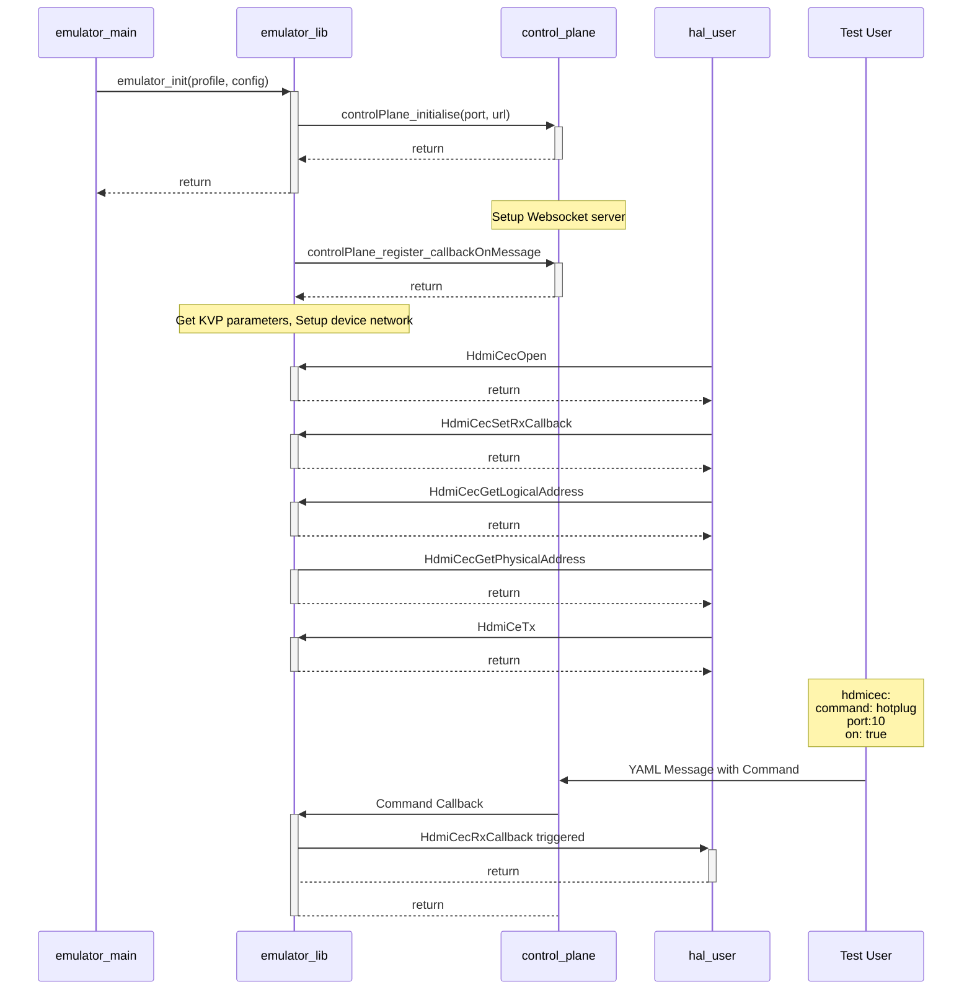
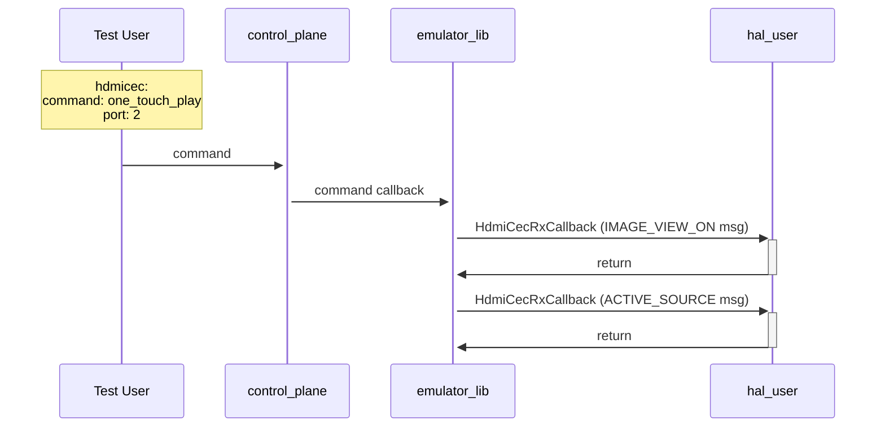
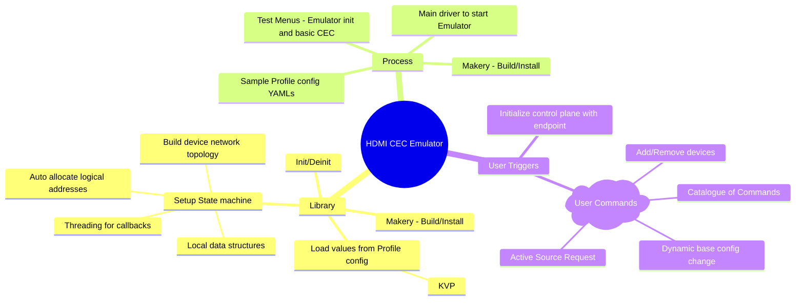

# HAL Emulator for HDMI CEC

- The HDMI CEC HAL interface test shall be enhanced to support an emulator that can be used as a Virtual device.
- Currently, rdk-halif-test-hdmi_cec supports a skeleton (stubbed out) implementation of the interface defined in rdk-halif-hdmi_cec. This shall be enhanced to support an emulator that mimics operations of a real device.
- The Emulator implementation shall replace the Skeleton implementation as the default.
- A Common emulator interface with Intitialize and Deinitialize methods shall be defined.
- Emulator shall be built as a separate binary (shared lib).

When the emulator process is started, emulator_initialize shall be called with YAML configuration file passed into it using the '--profile' parameter. The configuration for the control plane shall be passed in through the '--config' parameter

```
`./run --profile skyglass_sink_5_sources.yml --config xyz.yml`
```

Given below is a configuration template which provides all possible fields and it's intended values. The configuration template is intened to serve as a validation schema for the emulated device config.

```yaml
---
hdmicec:
  #Device logical types - Hints for emulator to auto allocate logical address
  device_type: &device_type
    - TV
    - STB_1
    - STB_2 
    - DVR_1
    - DVR_2
    - Chromecast
    - HomeTheatre
    - GamingConsole_1
    - GamingConsole_2
    - DVDPlayer_1
	  - DVDPlayer_2
    - AVR_1
    - AVR_2
    - Switcher_1
    - Switcher_2
    - Camera_1
    - Camera_2
    - SpecialPurpose
    - Unregistered
 
  #Port ID - Integer [1 to 15]
  port_id: &port_id
    !!int

  #Enum specifying port type
  #All references shown in the configuration templates are intended to provide possible values for the given type.
  #In practice, the below field would be defined as,
  # port_type: in
  port_type: &port_type
    - in
    - out

  #Vendor Info - Name and IEEE RAC vendor code
  vendor: &vendor
    - [TOSHIBA, 0x000039]
    - [SAMSUNG, 0x0000F0]
    - [DENON, 0x0005CD]
    - [MARANTZ, 0x000678]
    - [LOEWE, 0x000982]
    - [ONKYO, 0x0009B0]
    - [MEDION, 0x000CB8]
    - [TOSHIBA2, 0x000CE7]
    - [APPLE, 0x0010FA]
    - [HARMAN_KARDON2, 0x001950]
    - [GOOGLE, 0x001A11]
    - [AKAI, 0x0020C7]
    - [AOC, 0x002467]
    - [PANASONIC, 0x008045]
    - [PHILIPS, 0x00903E]
    - [DAEWOO, 0x009053]
    - [YAMAHA, 0x00A0DE]
    - [GRUNDIG, 0x00D0D5]
    - [PIONEER, 0x00E036]
    - [LG, 0x00E091]
    - [SHARP, 0x08001F]
    - [SONY, 0x080046]
    - [BROADCOM, 0x18C086]
    - [SHARP2, 0x534850]
    - [VIZIO, 0x6B746D]
    - [BENQ, 0x8065E9]
    - [HARMAN_KARDON, 0x9C645E]
    - [UNKNOWN, 0]

  #HDMI CEC Version supported by device
  cec_version: &cec_version 
    - 0  #Unknown
    - 1  #1.2
    - 2  #1.2A
    - 3  #1.3
    - 4  #1.3A
    - 5  #1.4
    - 6  #2.0

  #Power Status of the device
  power_status: &power_status
    - on
    - off
    - standby

	#Endpoint information 
  endpoint: &endpoint 
    name: !!str # Name of the Device in the network
	  id: *port_id # Port number 
	  type: *port_type # Type of Port from &port_type

	#Link represents a connection between 2 endpoints
	#Physical addresses will be based on links
	link: &link 
	  - *endpoint 
	  - *endpoint

  # Emulated Device's Information
  version: *cec_version  #Value from enum &cec_version
  type: *device_type  #Type of device from device_type list
  active_source: !!bool	 #Whether the device will start as active source
  vendor_info: *vendor  #Vendor info value pair from &vendor
  pwr_status: *power_status #Initial Power status from enum &power_status
  name: !!str #Name of the device
  number_ports: !!int
  ports: #Variable sized array of Ports belonging to Emulated device
    - id: *port_id
    #All references shown in the configuration templates are intended to provide possible values for the given type.
    #In practice, the below field would be defined as,
    # port_type: in
      type: *port_type  # Type of Port from &port_type
      cec_supported: !!bool
      arc_supported: !!bool
    - id: *port_id
      type: *port_type
      cec_supported: !!bool
      arc_supported: !!bool
  number_devices: !!int
  devices: # Variable sized array of Connected devices
    - type: *device_type  #Type of device from device_type list
      version: *cec_version
      active_source: !!bool
      vendor_info: *vendor
      pwr_status: *power_status
      name: !!str

    - type: *device_type
      version: *cec_version
      active_source: !!bool
      vendor_info: *vendor
      pwr_status: *power_status
      name: !!str

    - type: *device_type
      version: *cec_version
      active_source: !!bool
      vendor_info: *vendor
      pwr_status: *power_status
      name: !!str

    - type: *device_type
      version: *cec_version
      active_source: !!bool
      vendor_info: *vendor
      pwr_status: *power_status
      name: !!str

  # Variable sized array of links between end points
  # This represents the network of devices 
  links:
    - *link
    - *link
    - *link

```

A sample configuration file for the control plane

```yaml
---
controlplane: 
    ws:
        port: 8091
        url: /hdmicec

```

The Emulator will have a common interface that needs to be implemented along with the HAL driver interface functions.

`emulator.h`

```
int emulator_initialise(const char* profile, const char* config);

int emulator_deinitialise(void)
```

emulator_initialise will use the YAML decoding functionality via the Key-Value Pair (KVP) module available currently as part of the ut_core to read the profile parameters and create the initial state machine with number of HDMI Ports and the network of devices attached on the CEC bus. In addition, emulator will also intialise the control plane with the websocket parameters passed via '--config'.

The control plane inititialise function may look like this. This will setup the websocket server.

```
ut_kvp_instance_t conf_instance = ut_kvp_createInstance();
ut_kvp_status_t status = ut_kvp_read(&conf_instance, config);
uint16_t port = ut_kvp_getUInt32Field(&conf_instance, "controlplane.ws.port");
char* url = ut_kvp_getStringField(&conf_instance, "controlplane.ws.url");

controlPlane_initialise(port, url);

```

The emulator will also register with the control plane to receive callbacks when there is a command trigger from the Test user. These are YAML messages over Websocket. The register mechanism shall look like below,

```
controlPlane_register_callbackOnMessage("hdmicec.command", &myCallback);
```

The state machine of the Hdmi CEC hal is setup by populating its data structures by retreiving from the profile config. Below is an example of information about HDMI ports populated. The info on devices connected to the CEC bus is populated in a similar way to set up the initial state machine.

```
#define MAX_OSD_NAME_LENGTH 16

typedef enum {
    INPUT,
    OUTPUT
} port_type_t;

tyedef enum {
  ON,
  STANDBY,
  OFF
}power_status_t;

typedef struct port_info {
  uint8_t id;
  uint16_t physical_address;
  port_type_t type;
  bool cec_supported;
  bool arc_supported;
} port_info_t;

typedef struct device {
   uint32_t version;
   uint16_t physical_address;
   uint8_t logical_address;
   bool active_source;
   uint32_t vendor_id;
   power_status_t power_status;
   char osd_name[MAX_OSD_NAME_LENGTH];
}


---
ut_kvp_instance_t kvp_instance = ut_kvp_createInstance();
ut_kvp_status_t status = ut_kvp_read(&kvp_instance, profile);
uint32_t num_ports = ut_kvp_getUInt32Field(&kvp_instance, "hdmicec.num_ports");

port_info_t *ports = (port_info_t*)malloc(size(port_info_t) * num_ports);

char prefix_name[] = "hdmicec.ports.";
for(int i = 0; i < ports; i++)
{
      
}
---


```

The emulator also sets up the data structures to manage HdmiCec Tx and Rx callbacks when the respective interface function is called. This includes the threading mechanisms required to trigger callbacks to caller of HdmiCec driver. Below diagram depicts a typical call sequence with emulator handling commands from Test user and triggering HdmiCec Rx callback.



Some sample commands from control plane

Command to trigger a hotplug event from device connected in Port 2:

```yaml
hdmicec:
    command: hotplug
    port: 2
    on: true
```

Command to make device connected in port 2 as active_source:

```yaml
---
hdmicec:
    command: one_touch_play
    port: 2
```

The above command should trigger 2 call backs from the emulator to hal user. The emulator should be able to translate the commands received from test user into CEC message payload and trigger the call back.



Command to trigger a Broadcast message from Playback Device 1 to put all devices to standby (toggle)

```yaml
---
hdmicec:
    command: system_standby
    source: 4 # Logical address of Playback Device 1
    destination: F # Broadcast Logical address
```

Command to trigger a Device Menu Control command from Playback Device 2 to mute.

```yaml
---
hdmicec:
    command: user_control
    source: 8 # Logical address of Playback Device 1
    destination: 0 # Logical address of TV
    ui_command: 43 # Mute
```

Test user can also trigger a re-configuration of the initial profile with which the emulator state machine was set up, like the device type (Sink or Source) and the list of devices in the network etc.

Command to trigger a re-configuration of the initial state. The following config represents that the emulated device is Playback Device 1 and is connected to a TV on its Port. The TV also has a Chromecast connected to it on port 2.

```yaml
---
hdmicec:
  config:
    version: 4 
    type: STB_1
    active_source: true
    vendor: [SAMSUNG, 0x0000F0]
    power_status: on
    name: sky_xione
    number_ports: 1
    ports:
      - id: 1
        type: out
        cec_supported: true
        arc_supported: false
    number_devices: 2
    devices:
      - type: TV
	      version: 4
        active_source: false
        vendor_info: [SONY, 0x080046]
        pwr_status: on
        name: Sony TV
      - type: Chromecast
        version: 4
        active_source: false
        vendor_info: [GOOGLE, 0x001A11]
        power_status: on
        name: Chromecast

    links:
	   - - name: Sony TV
	       id: 1
	       type: in
         - name: sky_xione
		     id: 1
			   type: out
	   - - name: Sony TV
		     id: 2
			   type: in
		 - name: Chromecast
			   id: 1
			   type: out
```


The above configuration yaml instructs the emulator about the following devices connected.


This will trigger a complete reconfiguration of the emulator state machine by deleting and reconstructing its internal data base.


## Tasks Breakdown for MVP



