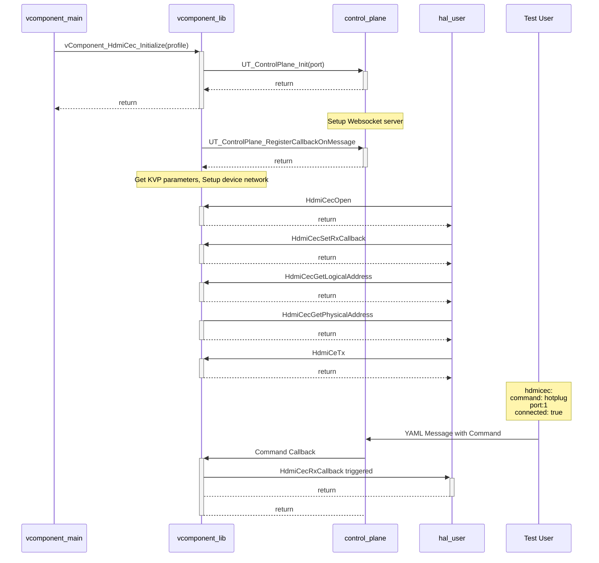
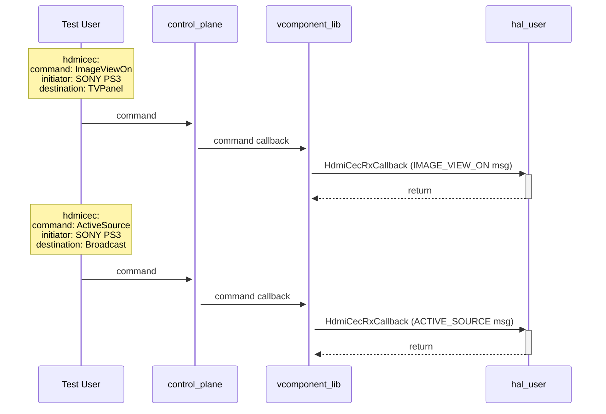
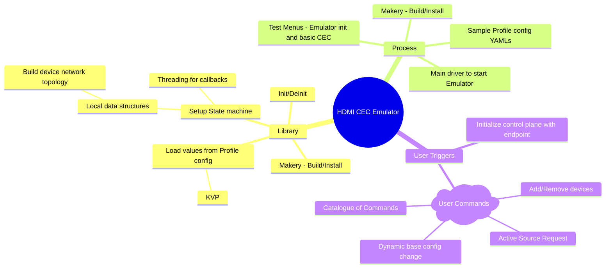

# Virtual Component for HDMI CEC HAL

- The HDMI CEC HAL interface test shall be enhanced to support a virtual component that can be used inside a Virtual device to emulate a real device that supports HDMI CEC.
- Currently, rdk-halif-test-hdmi_cec supports a skeleton (stubbed out) implementation of the interface defined in rdk-halif-hdmi_cec. This shall be enhanced to support a virtual component that mimics operations of a real device.
- The Virtual Component (vComponent) implementation shall replace the Skeleton implementation as the default.
- A Common Virtual Component interface with Intitialize and Deinitialize methods shall be defined.
- Virtual Component shall be built as a separate binary (shared lib).
- A Virtual device (vDevice) shall include one or more vComponents to cater a test setup.

When the vComponent process is started, vComponent_HdmiCec_Initialize shall be called with YAML configuration file passed into it using the '-p' parameter.

```
`./run -p tv_panel_5_devices.yaml`
```

## YAML Template for Profile

Below is the YAML template for the vComponent profile defintion. This YAML template intends to provide a blueprint of a profile config through anchor references. An actual profile would be a derivation of this template. The profile config provides a way to represent a CEC bus with a number of devices connected in a parent/children hierarchy starting from the root device. The `emulated_device` attribute defines the friendly name of the emulated vDevice. An emulated devcie can either be a Sink Device (TV) like or a Source Device like Settop boxes. The `device_map` list is a representation of the CEC bus and its networked devices. Each device can have a number of children and the `children` array lists the devices.

```yaml
---
hdmicec:
  #Device logical types - Hints for emulator to auto allocate logical address
  device_type: &device_type 
    - TV
    - PlaybackDevice
    - AudioSystem
    - RecordingDevice
    - Tuner
    - Reserved
    - Unregistered

  #Port ID - Integer [1 to 15]
  port_id: &port_id 
    !!int

  #Enum specifying port type
  #All references shown in the configuration templates are intended to provide possible values for the given type.
  #In practice, the below field would be defined as,
  # port_type: in
  port_type: &port_type
    - in
    - out

  #Vendor Info - Name and IEEE RAC vendor code
  vendor: &vendor
    - TOSHIBA
    - SAMSUNG
    - DENON
    - MARANTZ
    - LOEWE
    - ONKYO
    - MEDION
    - TOSHIBA2
    - APPLE
    - HARMAN_KARDON2
    - GOOGLE
    - AKAI
    - AOC
    - PANASONIC
    - PHILIPS
    - DAEWOO
    - YAMAHA
    - GRUNDIG
    - PIONEER
    - LG
    - SHARP
    - SONY
    - BROADCOM
    - SHARP2
    - VIZIO
    - BENQ
    - HARMAN_KARDON
    - TEST_VENDOR
    - UNKNOWN

  #HDMI CEC Version supported by device
  cec_version: &cec_version 
    - 0  #Unknown
    - 1  #1.2
    - 2  #1.2A
    - 3  #1.3
    - 4  #1.3A
    - 5  #1.4
    - 6  #2.0

  #Power Status of the device
  power_status: &power_status 
    - on
    - off
    - standby

  # Emulated Device's Information
  emulated_device: !!str # e.g, TVPanel 
  number_ports: !!int
  ports: #Variable sized array of Ports belonging to Emulated device
    - id: *port_id
  #All references shown in the configuration templates are intended to provide possible values for the given type.
  #In practice, the below field would be defined as,
  # port_type: in
      type: *port_type  # Type of Port from &port_type
      cec_supported: !!bool
      arc_supported: !!bool
    - id: *port_id
      type: *port_type
      cec_supported: !!bool
      arc_supported: !!bool

  number_devices: !!int # Total number of devices in the network
  device_map: # Map of devices starting from the Root Device (A TV) and multiple levels of children
    - name: !!str  #Unique name identifying the device.
      type: *device_type  #Type of device from device_type list. The top parent must be a root device (TV)
      version: *cec_version
      active_source: !!bool
      vendor_info: *vendor
      pwr_status: *power_status
      port_id: !!int  #Port id of the parent to which this device is connected. For root device, this will be 0.
      number_children: !!int  #Number of children connected to this device
      children:   #Array of devices that are connected to this parent
      - name: !!str
        type: *device_type
        version: *cec_version
        active_source: !!bool
        vendor_info: *vendor
        pwr_status: *power_status
        port_id: !!int  #Port id of the parent to which this device is connected
        number_children: !!int # 0, If no devices are connected. This parameter must be present for all devices

      - name: !!str
        type: *device_type
        version: *cec_version
        active_source: !!bool
        vendor_info: *vendor
        pwr_status: *power_status
        port_id: !!int  #Port id of the parent to which this device is connected
        number_children: !!int # 0, If no devices are connected.
        children:
          - name: !!str
            type: *device_type
            version: *cec_version
            active_source: !!bool
            vendor_info: *vendor
            pwr_status: *power_status
            port_id: !!int  #Port id of the parent to which this device is connected
            number_children: !!int # 0, If no devices are connected.
```

## An example Sink profile

Below is an example profile for a virtual TV Device emulating a TV Panel with a few devices connected to it on the CEC bus. A Sample profile config in YAML with a network of devices representing a TV as the root device (Sink), connected with an Audio System connected on the HDMI port 1 and a Sony PS3 connected on its HDMI port 2. The Audio system has a IPSTB box connected on its HDMI port 2 and a chromecast connected on its port 1.

```yaml
---
hdmicec:
    emulated_device: TVPanel
    number_ports: 3
    ports:
      - id: 1
        type: in
        cec_supported: true
        arc_supported: true
      - id: 2
        type: in
        cec_supported: true
        arc_supported: true
      - id: 3
        type: in
        cec_supported: true
        arc_supported: false

    number_devices: 5
    device_map:
      - name: TVPanel
        type: TV
        version: 4
        active_source: false
        vendor: TEST_VENDOR
        pwr_status: on
        port_id: 0
        number_children: 2
        children:
        - name: Sony HomeTheatre
          type: AudioSystem
          version: 4
          active_source: false
          vendor: SONY
          pwr_status: on
          port_id: 1
          number_children: 2
          children: 
            - name: Chromecast
              type: PlaybackDevice
              version: 4
              active_source: false
              vendor: GOOGLE
              pwr_status: on
              port_id: 1
              number_children: 0
            - name: IPSTB
              type: PlaybackDevice
              version: 4
              active_source: false
              vendor: TEST_VENDOR
              pwr_status: on
              port_id: 2
              number_children: 0
        - name: SONY PS3
          type: PlaybackDevice
          version: 4
          active_source: false
          vendor: SONY
          pwr_status: on
          port_id: 2
          number_children: 0
          
```

The vComponent on loading the profile, creates an internal map for the device network and auto allocate HDMI CEC physical and logical addresses. This makes it easier to manage user triggers using the Friendly Name of the device.

For the above example sink profile, the expected physical and logical address allocation would be as below.

| Device | Type | Physical Address | Logical Address |
| :--- | :--- | :--- | :--- |
| TVPanel | TV  | 0.0.0.0 | 0   |
| SONY HomeTheatre | AudioSystem | 1.0.0.0 | 5   |
| SONY PS3 | PlaybackDevice | 2.0.0.0 | 4   |
| IPSTB | PlaybackDevice | 1.2.0.0 | 8   |
| Chromecast | PlaybackDevice | 1.1.0.0 | 11  |

## vComponent Interface

The vComponent will have a common interface that needs to be implemented along with the HAL driver interface functions in hdmi_cec_driver.h.

`vcHdmiCec.h`

```
vcHdmiCec_t* vcHdmiCec_Initialize( void );

vcHdmiCec_Status_t vcHdmiCec_Open( vcHdmiCec_t* pVCHdmiCec, char* pProfilePath, bool enableCPMsgs );

vcHdmiCec_Status_t vcHdmiCec_Close( vcHdmiCec_t* pVCHdmiCec );

vcHdmiCec_Status_t vcHdmiCec_Deinitialize( vcHdmiCec_t *pvComponent );
```

vcHdmiCec_Open will use the YAML decoding functionality via the Key-Value Pair (KVP) module available currently as part of the ut_core to read the profile parameters and create the initial state machine with number of HDMI Ports and the network of devices attached on the CEC bus. In addition, vComponent will also intialise the control plane with the websocket port.

The control plane inititialise function may look like this. This will setup the websocket server.

```
ut_controlPlane_instance_t instance = UT_ControlPlane_Init(port);

```

The vComponent will also register with the control plane to receive callbacks when there is a command trigger from the Test user. These are YAML messages over Websocket. The register mechanism shall look like below,

```
UT_ControlPlane_RegisterCallbackOnMessage(instance, "hdmicec.command", &myCallback);
```

The state machine of the Hdmi CEC hal is setup by populating its data structures by retreiving from the profile config. Below is an example of information about HDMI ports populated. The info on devices connected to the CEC bus is populated in a similar way to set up the initial state machine.

```
#define MAX_OSD_NAME_LENGTH 16

typedef enum {
    INPUT,
    OUTPUT
} port_type_t;

tyedef enum {
  ON,
  STANDBY,
  OFF
}power_status_t;

typedef struct port_info {
  uint8_t id;
  uint16_t physical_address;
  port_type_t type;
  bool cec_supported;
  bool arc_supported;
} port_info_t;

typedef struct device {
   uint32_t version;
   uint16_t physical_address;
   uint8_t logical_address;
   bool active_source;
   uint32_t vendor_id;
   power_status_t power_status;
   char osd_name[MAX_OSD_NAME_LENGTH];
}


---
ut_kvp_instance_t kvp_instance = ut_kvp_createInstance();
ut_kvp_status_t status = ut_kvp_read(&kvp_instance, profile);
uint32_t num_ports = ut_kvp_getUInt32Field(&kvp_instance, "hdmicec.num_ports");

port_info_t *ports = (port_info_t*)malloc(size(port_info_t) * num_ports);

char prefix_name[] = "hdmicec.ports.";
for(int i = 0; i < ports; i++)
{
.......
}
---


```

## Control Plane Message flow

The emulator also sets up the data structures to manage HdmiCec Tx and Rx callbacks when the respective interface function is called. This includes the threading mechanisms required to trigger callbacks to caller of HdmiCec driver. Below diagram depicts a typical call sequence with emulator handling commands from Test user and triggering HdmiCec Rx callback.



Some sample commands from control plane

Command to trigger a hotplug event from device connected in Port 2:

```yaml
hdmicec:
    command: hotplug
    port: 2
    connected: false
```

User presses power on button in PS3 to come out of standby and makes the PS3 the active source.
Command to make virtual component, a TV, to switch to Power on:

```yaml
---
hdmicec:
    command: ImageViewOn
    initiator: SONY PS3
    destination: TVPanel
```

The above command should trigger 2 call backs from the emulator to hal user. The emulator should be able to translate the commands received from test user into CEC message payload and trigger the call back.

With the above setup, user trigger messages shall be as in the table below.

| User Trigger | Yaml Message | RX Callback Data | Action |
| :--- | :--- | :--- | :--- |
| ImageViewOn | <pre lang="yaml">\---  <br>hdmicec:  <br>  command: ImageViewOn  <br>  initiator: SONY PS3  <br>  destination: TVPanel</pre> | 40:04 | TV Powers On and enters display state |
| SetOSDName | <pre lang="yaml">\---  <br>hdmicec:  <br>  command: SetOSDName  <br>  initiator: IPSTB  <br>  destination: TVPanel <br>  osd_name: osd_name: IPSTB</pre> | 80:04:49:50:53:54:42 | TV Powers On and enters display state |
| ActiveSource | <pre lang="yaml">\---  <br>hdmicec:  <br>  command: ActiveSource  <br>  initiator: IPSTB  <br>  destination: TVPanel</pre> | 80:47:12:00 | Switches to relevant HDMI port |
| Standby | <pre lang="yaml">\---  <br>hdmicec:  <br>  command: Standby  <br>  initiator: TVPanel  <br>  destination: Broadcast</pre> | 0F:36 | Broadcasts all devices to go to standby |
| Hotplug | <pre lang="yaml">\---  <br>hdmicec:  <br>  command: hotplug  <br>  port: 1  <br>  connected: false</pre> | None | Reset logical address and change power state |
| Give Physical address | <pre lang="yaml">\---  <br>hdmicec:  <br>  command: GivePhysicalAddress  <br>  initiator: Sony HomeTheatre  <br>  destination: IPSTB</pre> | 54:83 | HdmiCecTx should be triggered with ReportPhysicalAddress |

## One Touch Play Feature

The One touch play feature allows a source device to become the active source with a single button press. Typically, in a real home setup, when the user presses play on a playback device that is connected to the TV, CEC messages are sent to the TV and the CEC bus to inform that the playback device has started streaming content. The TV on receiving the ImageViewOn message, will come out of the standby if needed and enters the display state. Subsequently, the playback device also broadcasts an ActiveSource message which allows the TV to switch to the relevant HDMI port that the playback device is connected on. The below sequence diagram shows how this senario can be emulated using the control plane to trigger the CEC messages. Here the Test user sends the YAML messages over websocket or http to the control plane.



## Standby Feature

Command to trigger a Broadcast message from Playback Device 1 to put all devices to standby (toggle)

```yaml
---
hdmicec:
    command: Standby
    initiator: IPSTB
    destination: Broadcast
```

## Device Menu Control

Command to trigger a Device Menu Control command from Playback Device 2 to mute.

```yaml
---
hdmicec:
    command: UserControl
    initiator: SONY PS3
    destination: TVPanel
    ui_command: Mute
```

## Validating L3 Tests using validation profile

Level 3 tests validate end-to-end functionality for a specific feature. In case of HDMI CEC L3 tests, when user triggers a command message the test can vaildate the callback data that is received through the HdmiCec Receive callback. For this, the validation profile and the actual profile shall be linked in a way they can be used to validate a particular test. For e.g, when the user triggers ActiveSource command through control plane, the yaml payload consists of Device Names as the primary handles, but the Receive callbacks that are generated as response for the commands contain raw cec data buffer that follow the HDMI CEC Specifications. This means, the L3 test will only have logical and physical addresses. The validation profile yaml can contain specific payload information to calidate against for a particualar test which corresponds to a selected main profile. In other words, tv_panel_5_devices.yaml profile will have a corresponding tv_panel_5_devices_vp.yaml.

An example validation yaml for a particular profile.

```yaml
---
hdmicec:
  ActiveSource:
    input:
      initiator: SONY PS3
      destination: TVPanel
    result:
      initiator: 4
      destination: 0
      opcode: 0x82   # Opcode as defined in HDMI CEC Specification
      parameters:
        size: 2
        data: [20, 0] # Physical address 2.0.0.0
	SetOSDName:
     input:
      initiator: IPSTB
      destination: TVPanel
      osd_name: IPSTB
     result:
      initiator: 4
      destination: 0
      opcode: 0x49 # Opcode as defined in HDMI CEC Specification
      parameters:
        size:
        data: [0x49,0x50,0x53,0x54,0x42] # "IPSTB" in hex ascii
```

## Reconfiguring the vComponent

Test user can also trigger a re-configuration of the initial profile with which the emulator state machine was set up, like the device type (Sink or Source) and the list of devices in the network etc.

Command to trigger a re-configuration of the initial state. The following config represents that the emulated device is Playback Device 1 and is connected to a TV on its Port. The TV also has a Chromecast connected to it on port 2.

```yaml
---
hdmicec:
  config:
    emulated_device: IPSTB
    number_ports: 1
    ports:
      - id: 1
        type: out
        cec_supported: true
        arc_supported: false
    number_devices: 3
    device_map:
      - name: Sony TV
        type: TV
        version: 4
        active_source: false
        vendor_info: SONY
        pwr_status: on
        number_chlidren: 2
        children:
         -  name: IPSTB
            type: PlaybackDevice
            version: 4 
            active_source: true
            vendor: TEST_VENDOR
            pwr_status: on
            port_id: 1
            num_children: 0
            
         -  name: Chromecast
            type: PlaybackDevice
            version: 4
            active_source: false
            vendor: GOOGLE
            pwr_status: on
            port_id: 1
            num_children: 0
```

The above configuration yaml instructs the emulator about the following devices connected.


This will trigger a complete reconfiguration of the emulator state machine by deleting and reconstructing its internal data base.

## Tasks Breakdown for MVP


