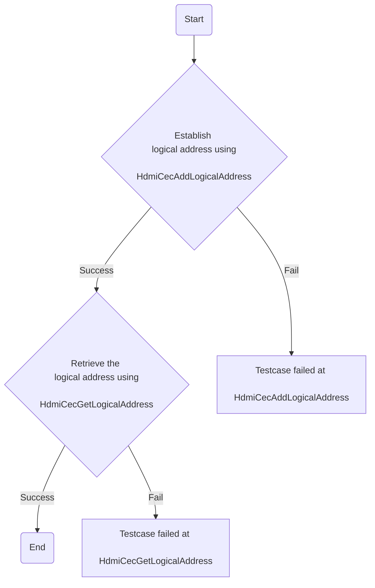
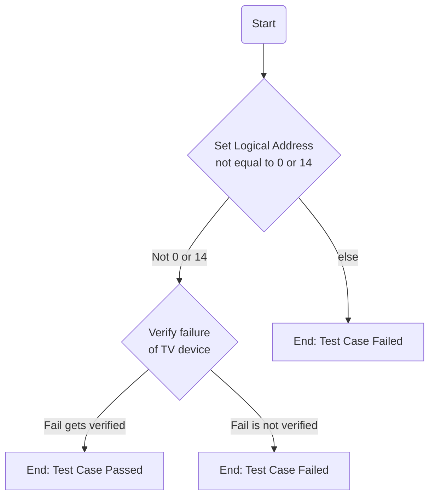
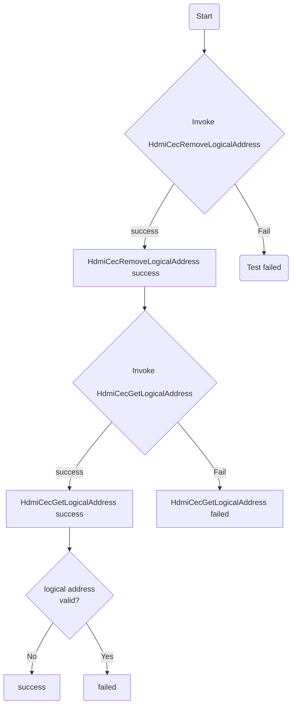
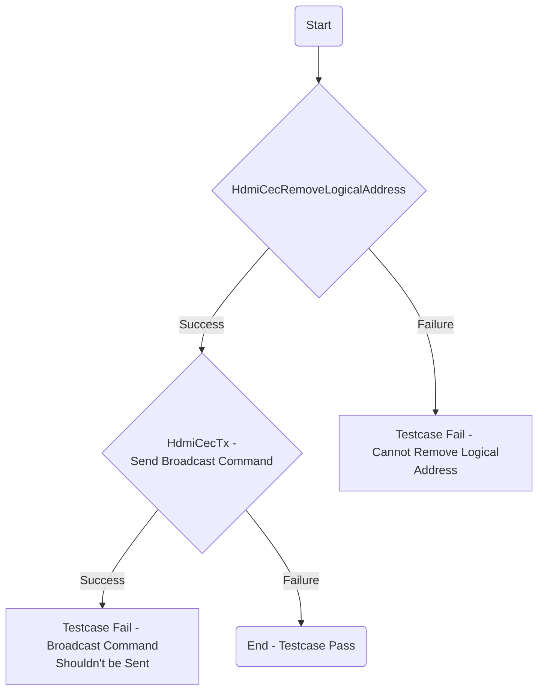
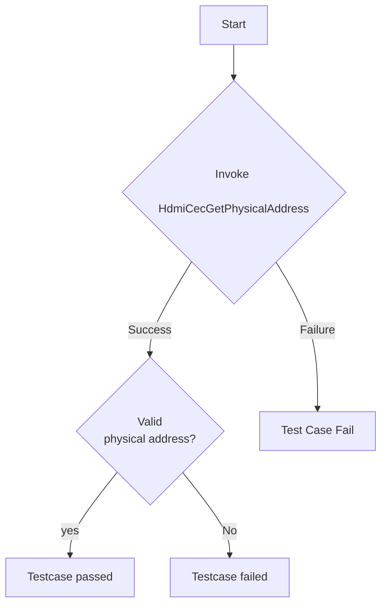

### Test 1

|Title|Details|
|--|--|
|Function Name|`test_l2_hdmi_cec_driver_AddAndGetLogicalAddress`|
|Description|Testing the functionality of adding and getting the logical address using `HdmiCecAddLogicalAddress` and `HdmiCecGetLogicalAddress`.|
|Test Group|Module: 02|
|Test Case ID|001|
|Priority|High|

**Pre-Conditions :** None

**Dependencies :** None

**User Interaction :** If user chose to run the test in interactive mode, then the test case has to be selected via console.

#### Test Procedure :

| Variation / Steps | Description | Test Data | Expected Result | Notes|
| -- | --------- | ---------- | -------------- | ----- |
| 01 | Establish a logical address using `HdmiCecAddLogicalAddress`. | handle = valid handle , logicalAddresses = 0x00 | HDMI_CEC_IO_SUCCESS | Should be successful |
| 02 | Retrieve the logical address using `HdmiCecGetLogicalAddress` if the previous call was successful. | handle = valid handle, logicalAddress = address of integer variable | HDMI_CEC_IO_SUCCESS | Should be successful |

### Test 2

|Title|Details|
|--|--|
|Function Name|`test_l2_hdmi_cec_driver_AddLogicalAddressFailure`|
|Description|This test checks whether the function `HdmiCecAddLogicalAddress` returns the correct `status` after being invoked with an valid handle. The expected result, as per the function, is a failure, which is confirmed through an assertion in the test.|
|Test Group|Module : 02|
|Test Case ID|002|
|Priority|High|

**Pre-Conditions :** None

**Dependencies :** None

**User Interaction :** If user chose to run the test in interactive mode, then the test case has to be selected via console.

#### Test Procedure :

| Variation / Steps | Description | Test Data | Expected Result | Notes|
| -- | --------- | ---------- | -------------- | ----- |
| 01 | Initializing `handle` variable with value `15` and other variables which would be used in the API invocation. | `handle = 15` | N/A | N/A |
| 02 | Invoke `HdmiCecAddLogicalAddress` with `handle = 15`. | `handle = 15, &logicalAddress = address of logicalAddress` | `status` of the function will be the returned value. | N/A |
| 03 | Checking if status returned from `HdmiCecAddLogicalAddress` function is not `HDMI_CEC_IO_SUCCESS`, as `handle` is neither `0` nor `14`. | `handle = 15` | `status` should not be equal to `HDMI_CEC_IO_SUCCESS`. | Should fail |

### Test 3

|Title|Details|
|--|--|
|Function Name|`test_l2_hdmi_cec_driver_removeAndGetLogicalAddress`|
|Description|This test checks the functionality of handle removal and getting a logical address using `HdmiCecRemoveLogicalAddress` and `HdmiCecGetLogicalAddress` respectively.|
|Test Group|Module : 02|
|Test Case ID|003|
|Priority|High|

**Pre-Conditions :** None

**Dependencies :** None

**User Interaction :** If user chose to run the test in interactive mode, then the test case has to be selected via console.

#### Test Procedure :

| Variation / Steps | Description | Test Data | Expected Result | Notes|
| -- | --------- | ---------- | -------------- | ----- |
|01| Invoke HdmiCecRemoveLogicalAddress with a valid handle and logical address as 0 | handle = NULL, logicalAddresses = 0  | HDMI_CEC_IO_SUCCESS | Should be successful |
|02| Post removal, invoke HdmiCecGetLogicalAddress to verify the absence of the logical address | handle = valid handle | logicalAddresses = 0xF, statusGet = HDMI_CEC_IO_SUCCESS | Should be successful |

### Test 4

|Title|Details|
|--|--|
|Function Name|`test_l2_hdmi_cec_driver_RemoveAndBroadcastFail`|
|Description|This test validates that the HDMI CEC driver logic removes logical addresses and verifies that broadcast commands are not sent. This is crucial to prevent potential communication breakdowns across the network.|
|Test Group|Module : 02|
|Test Case ID|004|
|Priority|High|

**Pre-Conditions :** None

**Dependencies :** None

**User Interaction :**  If user chose to run the test in interactive mode, then the test case has to be selected via console.

#### Test Procedure :

| Variation / Steps | Description | Test Data | Expected Result | Notes|
| -- | --------- | ---------- | -------------- | ----- |
| 01 | Invoke `HdmiCecRemoveLogicalAddress` method using defined handle and logical address | handle = 1, logicalAddresses = 0 | HDMICECSTATUS_SUCCESS | Should be successful |
| 02 | If the HdmiCecRemoveLogicalAddress executed successfully, then invoke `HdmiCecTx` method for broadcasting with parameters handle, NULL buffer and length zero | handle = 1, buf = NULL, len = 0, result = NULL | HDMICECSTATUS_FAILED | Should fail, as per test objective Broadcast Command should not be sent |

### Test 5

|Title|Details|
|-|-|
|Function Name| `test_l2_hdmi_cec_driver_GetPhysicalAddress`|
|Description|The test function is designed to test the functionality of fetching the physical address from HDMI CEC using `HdmiCecGetPhysicalAddress` and validating whether the retrieved physical address is valid or not.|
|Test Group|Module : 02|
|Test Case ID|005|
|Priority|High|

**Pre-Conditions :** None

**Dependencies :** None

**User Interaction :** If user chose to run the test in interactive mode, then the test case has to be selected via console.

#### Test Procedure :

| Variation / Steps | Description | Test Data | Expected Result | Notes|
| -- | --------- | ---------- | -------------- | ----- |
| 01 | Initialize a handle which will be used to get the physical address | handle = 1 | HDMI_CEC_IO_SUCCESS | Should be successful |
| 02 | Invoke `HdmiCecGetPhysicalAddress` API using a valid handle and a pointer to unsigned integer for storing the obtained physical address  | handle = valid, physicalAddress = pointer to an unsigned integer | HDMI_CEC_IO_SUCCESS | Should be successful |
| 03 | Validate the HDMI CEC IO status success and the obtained physical address shouldn't be zero | physicalAddress != 0 | HDMI_CEC_IO_SUCCESS | Should be successful |

