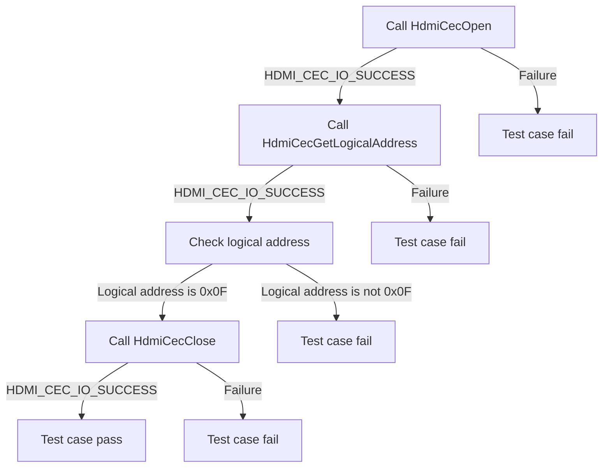
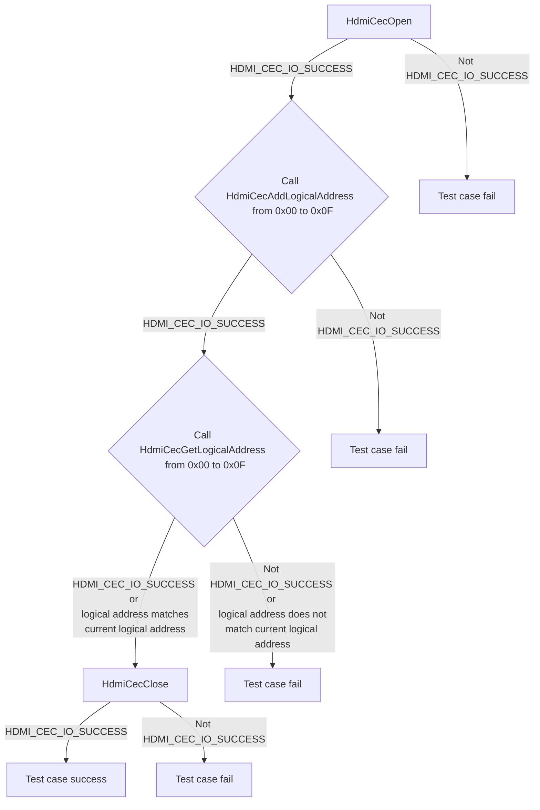
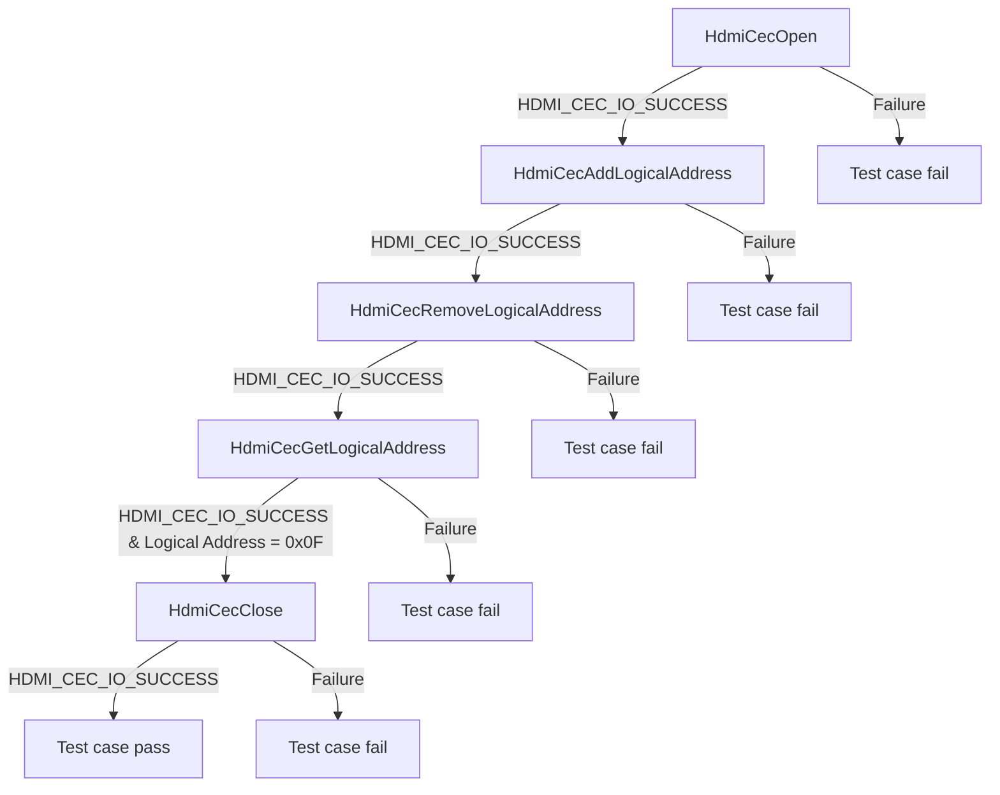
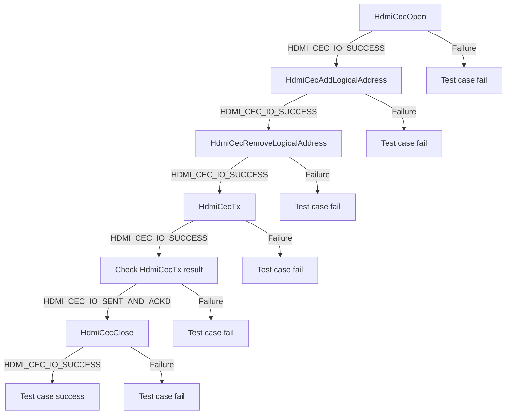
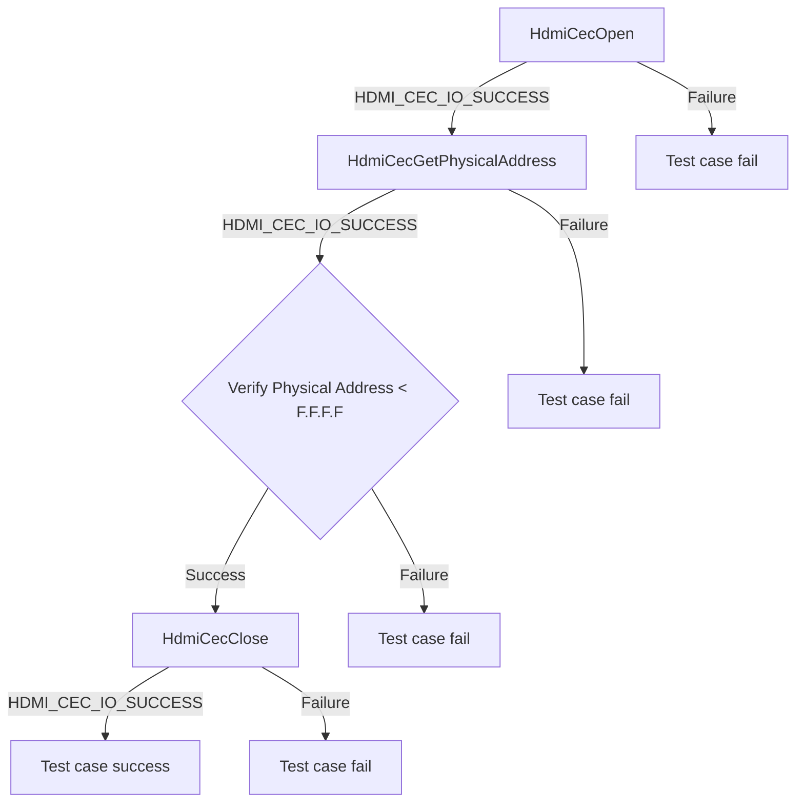
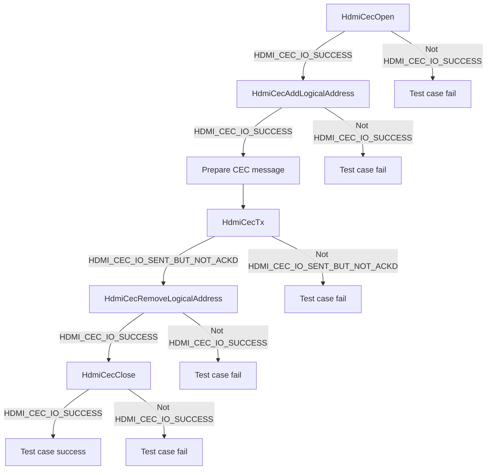

# HDMI CEC DRIVER Level 2 - Module Testing

| Version | Date(YY-MM-DD) | Comments |
| -------| ----- |  ----- |
| 1.0.0 | 22/05/24 | Inital Document |

## Table of Contents

- [HDMI CEC DRIVER Level 2 - Module Testing](#hdmi-cec-driver-level-2---module-testing)
  - [History](#history)
  - [Table of Contents](#table-of-contents)
  - [Overview](#overview)
    - [Acronyms, Terms and Abbreviations](#acronyms-terms-and-abbreviations)
    - [Definitions](#definitions)
    - [References](#references)
  - [Level 2 Test Suite](#level-2-test-suite)

## Overview

This document describes the level 2 testing suite for the HDMI CEC DRIVER module.

### Acronyms, Terms and Abbreviations

- `HAL` \- Hardware Abstraction Layer, may include some common components
- `HAL.h`  \- Abstracted defined API to control the hardware
- `HAL.c`  \- Implementation wrapper layer created by the `OEM` or `SoC` Vendor.
- `RDK`  \- Reference Design Kit for All Devices
- `RDK-B`  \- Reference Design Kit for Broadband Devices
- `RDK-V`  \- Reference Design Kit for Video Devices
- `UT`  \- Unit Test(s)
- `OEM`  \- Original Equipment Manufacture
- `SoC`  \- System on a Chip

### Definitions

- `Soc Vendor` \- Definition to encompass multiple vendors
- `Unit Tests` \- C Function tests that run on the target hardware
- `Common Testing Framework` \- Off the shelf 3rd Party Testing Framework, or framework that does not require infrastructure to control it. That's not to say it cannot be controlled via infrastructure if required. Examples of which are.
  - `GTest` \- Google Test Suit <https://google.github.io/googletest>
  - `CUnit` \- C Testing Suit <http://cunit.sourceforge.net/>
  - `Unity` \- C Embedded Testing Suit <http://www.throwtheswitch.org/unity>
  - `ut-core` \- Common Testing Framework <https://github.com/rdkcentral/ut-core>, which wraps a open-source framework that can be expanded to the requirements for future framework.

### References

- `Feedback Loops` \- <https://www.softwaretestingnews.co.uk/4-methods-to-improve-your-feedback-loops-and-supercharge-your-testing-process/>
- `Doxygen` \- SourceCode documentation tool - <https://www.doxygen.nl/index.html>
- `Black Box Testing` \- <https://en.wikipedia.org/wiki/Black-box_testing>

## Level 2 Test Suite

The following functions are expecting to test the module operates correctly.

### Test 1

|Title|Details|
|--|--|
|Function Name|`test_l2_hdmi_cec_driver_GetDefaultLogicalAddress`|
|Description|Get the logical address of the `DUT` without actually adding the Logical Address and the API should return 0x0F as the default logical address.|
|Test Group|Module : 02|
|Test Case ID|001|
|Priority|High|

**Pre-Conditions :**
None

**Dependencies :**
None

**User Interaction :**
If user chose to run the test in interactive mode, then the test case has to be selected via console.

#### Test Procedure :

| Variation / Steps | Description | Test Data | Expected Result | Notes|
| -- | --------- | ---------- | -------------- | ----- |
| 01 | Call the pre-requisite API HdmiCecOpen() | handle = 0 | HDMI_CEC_IO_SUCCESS | Should be successful |
| 02 | Call the API HdmiCecGetLogicalAddress() | handle = valid handle, logicalAddress = 0 | HDMI_CEC_IO_SUCCESS | Should be successful |
| 03 | Check the logical address |  | logicalAddress = 0x0F| Should be successful |
| 04 | Call the post-requisite API HdmiCecClose() | handle = valid handle | HDMI_CEC_IO_SUCCESS | Should be successful |

### Test 2

|Title|Details|
|--|--|
|Function Name|`test_l2_hdmi_cec_driver_AddAndGetLogicalAddress`|
|Description|Setup all valid logical addresses b/w 0x00 to 0x0F for the `DUT` using HAL APIs, then retrieve it to ensure proper functionality.|
|Test Group|Module : 02|
|Test Case ID|002|
|Priority|High|

**Pre-Conditions :**
None

**Dependencies :**
None

**User Interaction :**
If user chose to run the test in interactive mode, then the test case has to be selected via console.

#### Test Procedure :

| Variation / Steps | Description | Test Data | Expected Result | Notes|
| -- | --------- | ---------- | -------------- | ----- |
| 01 | Open the HDMI CEC driver using HdmiCecOpen API | handle = valid pointer | HDMI_CEC_IO_SUCCESS | Should be successful |
| 02 | Add each logical address from 0x00 to 0x0F using HdmiCecAddLogicalAddress API | handle = valid handle, logicalAddress = 0x00 to 0x0F | HDMI_CEC_IO_SUCCESS | Should be successful |
| 03 | Get each logical address from 0x00 to 0x0F using HdmiCecGetLogicalAddress API | handle = valid handle | HDMI_CEC_IO_SUCCESS , logical address = current logical address | Should be successful |
| 04 | Close the HDMI CEC driver using HdmiCecClose API | handle = valid handle | HDMI_CEC_IO_SUCCESS | Should be successful |

### Test 3

|Title|Details|
|--|--|
|Function Name|`test_l2_hdmi_cec_driver_RemoveLogicalAddress`|
|Description|Invoke the HAL API to delete the `DUT` logical address and verify that it is removed successfully.|
|Test Group|Module : 02|
|Test Case ID|003|
|Priority|High|

**Pre-Conditions :**
None

**Dependencies :**
None

**User Interaction :**
If user chose to run the test in interactive mode, then the test case has to be selected via console.

#### Test Procedure :

| Variation / Steps | Description | Test Data | Expected Result | Notes|
| -- | --------- | ---------- | -------------- | ----- |
| 01 | Open the HDMI CEC driver using HdmiCecOpen API | handle = valid handle | HDMI_CEC_IO_SUCCESS | Should be successful |
| 02 | Add a logical address using HdmiCecAddLogicalAddress API | handle = valid handle, logicalAddress = 0x00 | HDMI_CEC_IO_SUCCESS | Should be successful |
| 03 | Remove the logical address using HdmiCecRemoveLogicalAddress API | handle = valid handle, logicalAddress = 0x00 | HDMI_CEC_IO_SUCCESS | Should be successful |
| 04 | Get the logical address using HdmiCecGetLogicalAddress API | handle = valid handle, logicalAddress = valid buffer | HDMI_CEC_IO_SUCCESS , logicalAddress = 0x0F | Should be successful |
| 05 | Close the HDMI CEC driver using HdmiCecClose API | handle = valid handle | HDMI_CEC_IO_SUCCESS | Should be successful |

### Test 4

|Title|Details|
|--|--|
|Function Name|`test_l2_hdmi_cec_driver_BroadcastHdmiCecCommand`|
|Description|After deleting the `DUT` logical address, try to send a broadcast HDMI CEC Command (as per 1.4b HDMI CEC spec) and confirm transmission is successful.|
|Test Group|Module : 02|
|Test Case ID|004|
|Priority|High|

**Pre-Conditions :**
None

**Dependencies :**
None

**User Interaction :**
If user chose to run the test in interactive mode, then the test case has to be selected via console.

#### Test Procedure :

| Variation / Steps | Description | Test Data | Expected Result | Notes|
| -- | --------- | ---------- | -------------- | ----- |
| 01 | Open HDMI CEC using HdmiCecOpen | handle = valid buffer | HDMI_CEC_IO_SUCCESS | Should be successful |
| 02 | Add logical address using HdmiCecAddLogicalAddress | handle = valid handle, logicalAddresses = 0x0 | HDMI_CEC_IO_SUCCESS | Should be successful |
| 03 | Remove logical address using HdmiCecRemoveLogicalAddress | handle = valid handle, logicalAddresses = 0x0 | HDMI_CEC_IO_SUCCESS | Should be successful |
| 04 | Transmit CEC message using HdmiCecTx | handle = valid handle, buf = {0x0F, 0x84, 0x00, 0x00}, len = sizeof(buf), result = valid buffer | HDMI_CEC_IO_SUCCESS | Should be successful |
| 05 | Check the result of transmission | result = valid buffer | HDMI_CEC_IO_SENT_AND_ACKD | Should be successful |
| 06 | Close HDMI CEC using HdmiCecClose | handle = valid handle | HDMI_CEC_IO_SUCCESS | Should be successful |

### Test 5

|Title|Details|
|--|--|
|Function Name|`test_l2_hdmi_cec_driver_VerifyPhysicalAddress`|
|Description|Verify the valid physical address allocated through the HAL function.|
|Test Group|Module : 02|
|Test Case ID|005|
|Priority|High|

**Pre-Conditions :**
None

**Dependencies :**
None

**User Interaction :**
If user chose to run the test in interactive mode, then the test case has to be selected via console.

#### Test Procedure :

| Variation / Steps | Description | Test Data | Expected Result | Notes|
| -- | --------- | ---------- | -------------- | ----- |
| 01 | Call the pre-requisite API HdmiCecOpen() | handle = valid handle | HDMI_CEC_IO_SUCCESS | Should be successful |
| 02 | Call the API HdmiCecGetPhysicalAddress() | handle = valid handle, physicalAddress = valid address | HDMI_CEC_IO_SUCCESS | Should be successful |
| 03 | Check the return status of HdmiCecGetPhysicalAddress() | status = return status of HdmiCecGetPhysicalAddress() | HDMI_CEC_IO_SUCCESS | Should be successful |
| 04 | Verify that the physical address obtained is less than F.F.F.F | physicalAddress = obtained physical address | physicalAddress < 0xFFFF | Should be successful |
| 05 | Call the post-requisite API HdmiCecClose() | handle = valid handle | HDMI_CEC_IO_SUCCESS | Should be successful |

### Test 6

|Title|Details|
|--|--|
|Function Name|`test_l2_hdmi_cec_driver_TransmitCECCommand`|
|Description|Transmit a HDMI CEC Command (as per 1.4b HDMI CEC spec) to get the CEC Version of a device that doesn't exist.|
|Test Group|Module : 02|
|Test Case ID|006|
|Priority|High|

**Pre-Conditions :**
None

**Dependencies :**
None

**User Interaction :**
If user chose to run the test in interactive mode, then the test case has to be selected via console.

#### Test Procedure :

| Variation / Steps | Description | Test Data | Expected Result | Notes|
| -- | --------- | ---------- | -------------- | ----- |
| 01 | Open HDMI CEC driver using HdmiCecOpen | handle = valid buffer | HDMI_CEC_IO_SUCCESS | Should be successful |
| 02 | Add logical address using HdmiCecAddLogicalAddress | handle = valid handle, logicalAddresses = 0x4 | HDMI_CEC_IO_SUCCESS | Should be successful |
| 03 | Transmit CEC command using HdmiCecTx | handle = valid handle, buf = {0x47, 0x9F}, len = sizeof(buf), result = valid buffer | HDMI_CEC_IO_SENT_BUT_NOT_ACKD, result = HDMI_CEC_IO_SENT_BUT_NOT_ACKD | Should be successful |
| 04 | Remove logical address using HdmiCecRemoveLogicalAddress | handle = valid handle, logicalAddresses = 0x4 | HDMI_CEC_IO_SUCCESS | Should be successful |
| 05 | Close HDMI CEC driver using HdmiCecClose | handle = valid handle | HDMI_CEC_IO_SUCCESS | Should be successful |

