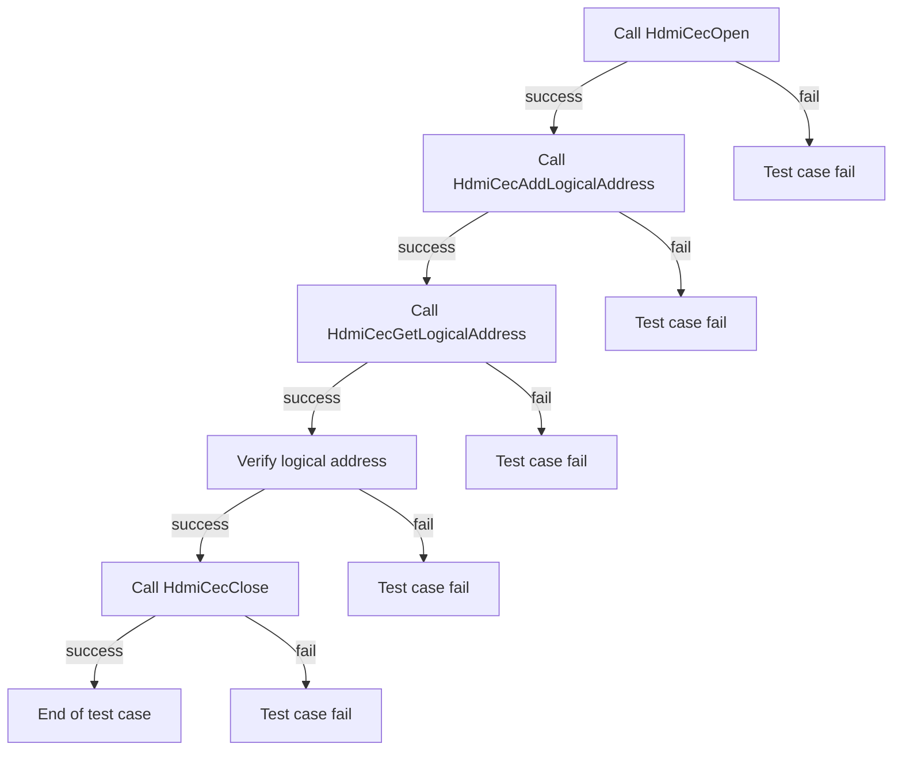
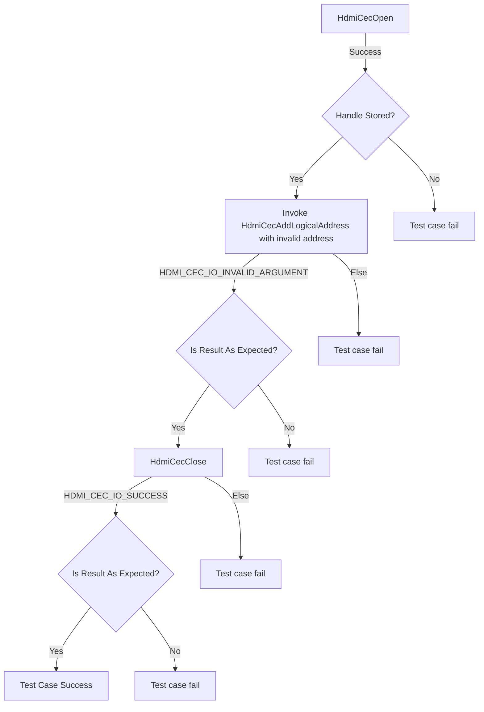
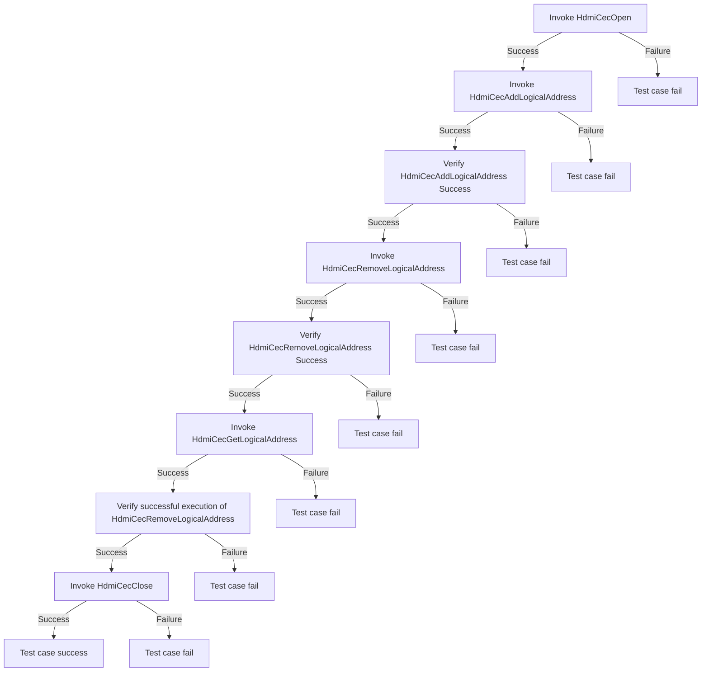
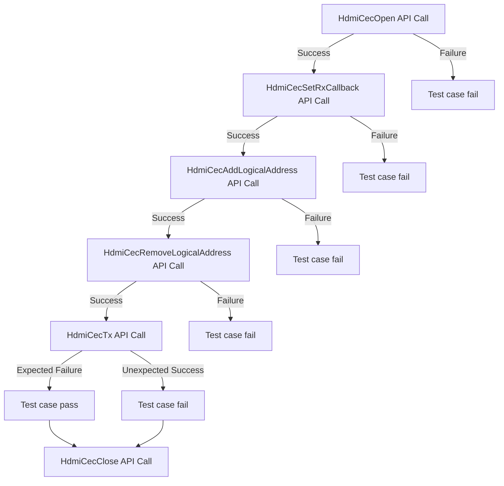
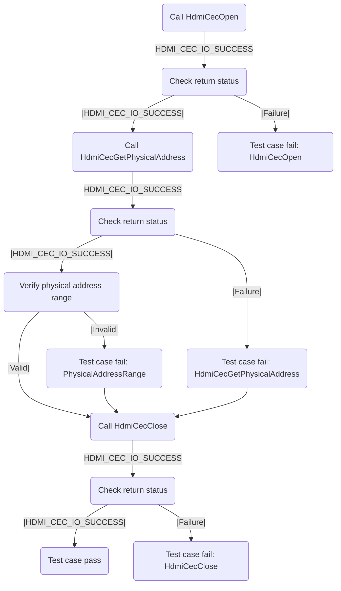

### Test 1

|Title|Details|
|--|--|
|Function Name|`test_l2_hdmi_cec_driver_AddAndGetLogicalAddress`|
|Description|Establish my logical address (through HAL APIs) as valid, then retrieve it to verify correct functionality.|
|Test Group|Module : 02|
|Test Case ID|001|
|Priority|High|

**Pre-Conditions :** None

**Dependencies :** None

**User Interaction :** If user chose to run the test in interactive mode, then the test case has to be selected via console.

#### Test Procedure :

| Variation / Steps | Description | Test Data | Expected Result | Notes|
| -- | --------- | ---------- | -------------- | ----- |
| 01 | Open HDMI CEC HAL using HdmiCecOpen | handle = valid buffer | HDMI_CEC_IO_SUCCESS | Should be successful |
| 02 | Add a valid Logical Address using HdmiCecAddLogicalAddress | handle = valid handle, logicalAddress = 0x0 | HDMI_CEC_IO_SUCCESS | Should be successful |
| 03 | Get Logical Address using HdmiCecGetLogicalAddress and verify against added address | handle = valid handle, getLogicalAddress = valid buffer | HDMI_CEC_IO_SUCCESS, getLogicalAddress = logicalAddress | Should be successful |
| 04 | Close HDMI CEC HAL using HdmiCecClose | handle = valid handle | HDMI_CEC_IO_SUCCESS | Should be successful |

### Test 2

|Title|Details|
|--|--|
|Function Name|`test_l2_hdmi_cec_driver_ValidateLogicalAddress`|
|Description|If the logical address is set to anything other than 0 (Allocated TV address) or 14 (Wild card address), it should result in a failure of a TV device.|
|Test Group|Module : 02|
|Test Case ID|002|
|Priority|High|

**Pre-Conditions :** None

**Dependencies :** None

**User Interaction :** If user chose to run the test in interactive mode, then the test case has to be selected via console.

#### Test Procedure :

| Variation / Steps | Description | Test Data | Expected Result | Notes|
| -- | --------- | ---------- | -------------- | ----- |
| 01 | Open the HDMI CEC driver using HdmiCecOpen | handle = valid buffer | HDMI_CEC_IO_SUCCESS | Should be successful |
| 02 | Add an invalid logical address to the HDMI CEC driver using HdmiCecAddLogicalAddress | handle = valid handle, logicalAddresses = 0x1 | HDMI_CEC_IO_INVALID_ARGUMENT | Should fail |
| 03 | Close the HDMI CEC driver using HdmiCecClose | handle = valid handle | HDMI_CEC_IO_SUCCESS | Should be successful |

### Test 3

|Title|Details|
|--|--|
|Function Name|`test_l2_hdmi_cec_driver_checkLogicalAddress`|
|Description|Invoke the HAL API to delete my logical address and verify that it is removed successfully.|
|Test Group|Module : 02|
|Test Case ID|003|
|Priority|High|

**Pre-Conditions :** None

**Dependencies :** None

**User Interaction :** If user chose to run the test in interactive mode, then the test case has to be selected via console.

#### Test Procedure :

| Variation / Steps | Description | Test Data | Expected Result | Notes|
| -- | --------- | ---------- | -------------- | ----- |
| 01 | Open HDMI CEC HAL using HdmiCecOpen | handle = valid buffer | HDMI_CEC_IO_SUCCESS | Should be successful |
| 02 | Add Logical Address using HdmiCecAddLogicalAddress | handle = valid handle, logicalAddress = 0x0 | HDMI_CEC_IO_SUCCESS | Should be successful |
| 03 | Remove Logical Address using HdmiCecRemoveLogicalAddress | handle = valid handle, logicalAddress = 0x0 | HDMI_CEC_IO_SUCCESS | Should be successful |
| 04 | Get Logical Address using HdmiCecGetLogicalAddress | handle = valid handle, logicalAddress = valid buffer | HDMI_CEC_IO_SUCCESS and logicalAddress = 0x0F | Should fail |
| 05 | Close HDMI CEC HAL using HdmiCecClose | handle = valid handle | HDMI_CEC_IO_SUCCESS | Should be successful |

### Test 4

|Title|Details|
|--|--|
|Function Name|`test_l2_hdmi_cec_driver_ValidateHALTransmissionAfterAddressRemoval`|
|Description|After deleting the logical address, the test tries to send a broadcast command. It should fail to send during HAL Transmission call.|
|Test Group|Module : 02|
|Test Case ID|004|
|Priority|High|

**Pre-Conditions :** None

**Dependencies :** None

**User Interaction :**
If user chose to run the test in interactive mode, then the test case has to be selected via console.

#### Test Procedure :

| Variation / Steps | Description | Test Data | Expected Result | Notes|
| -- | --------- | ---------- | -------------- | ----- |
| 01 | Open HDMI CEC with HdmiCecOpen | handle = valid handle | HDMI_CEC_IO_SUCCESS | Should be successful |
| 02 | Set Rx Callback with HdmiCecSetRxCallback | handle = valid handle, callback = NULL, user_data = NULL | HDMI_CEC_IO_SUCCESS | Should be successful |
| 03 | Add Logical Address with HdmiCecAddLogicalAddress | handle = valid handle, logicalAddresses = 0x0 | HDMI_CEC_IO_SUCCESS | Should be successful |
| 04 | Remove Logical Address with HdmiCecRemoveLogicalAddress | handle = valid handle, logicalAddresses = 0x0 | HDMI_CEC_IO_SUCCESS | Should be successful |
| 05 | Transmit with HdmiCecTx after removing logical address | handle = valid handle, buf = {0x3F, CEC_GET_CEC_VERSION}, len = 1, result = valid result buffer | return status != HDMI_CEC_IO_SUCCESS | Should be successful |
| 06 | Close HDMI CEC with HdmiCecClose | handle = valid handle | HDMI_CEC_IO_SUCCESS | Should be successful |

### Test 5

|Title|Details|
|--|--|
|Function Name|`test_l2_hdmi_cec_driver_VerifyPhysicalAddressAllocation`|
|Description|Verify the valid physical address allocated through the HAL function.|
|Test Group|Module : 02|
|Test Case ID|005|
|Priority|High|

**Pre-Conditions :** None

**Dependencies :** None

**User Interaction :** If user chose to run the test in interactive mode, then the test case has to be selected via console.

#### Test Procedure :

| Variation / Steps | Description | Test Data | Expected Result | Notes|
| -- | --------- | ---------- | -------------- | ----- |
| 01 | Open the HDMI CEC driver using HdmiCecOpen | handle = valid buffer | HDMI_CEC_IO_SUCCESS | Should be successful |
| 02 | Get the physical address using HdmiCecGetPhysicalAddress | handle = valid handle, physicalAddress = valid buffer | HDMI_CEC_IO_SUCCESS | Should be successful |
| 03 | Check if the physical address is within the valid range | physicalAddress = obtained value | physicalAddress should be between 0 and max_address | Should be successful |
| 04 | Close the HDMI CEC driver using HdmiCecClose | handle = valid handle | HDMI_CEC_IO_SUCCESS | Should be successful |

