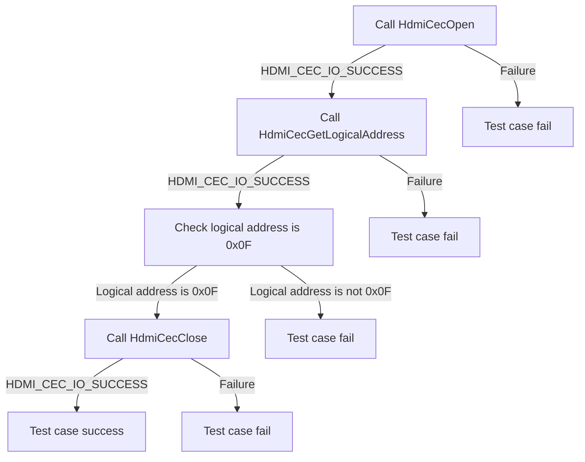
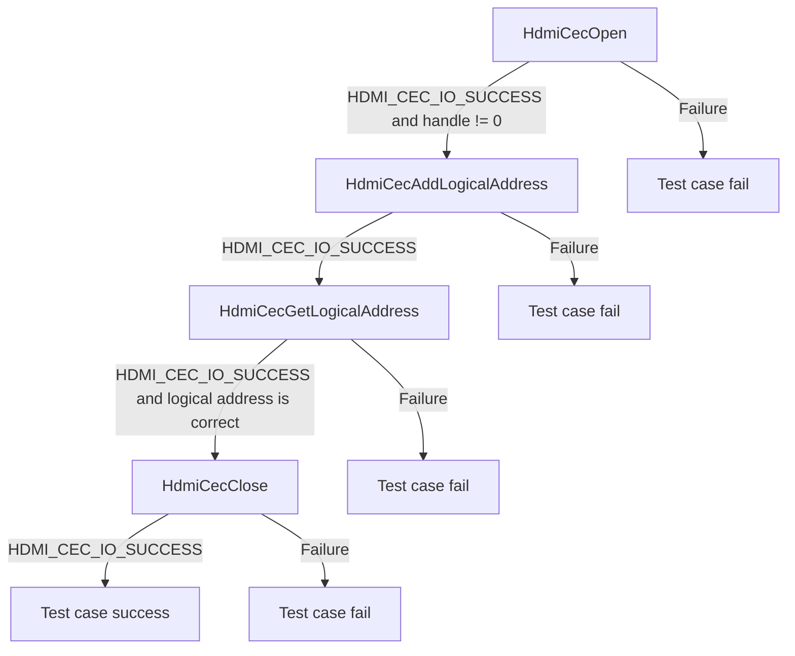
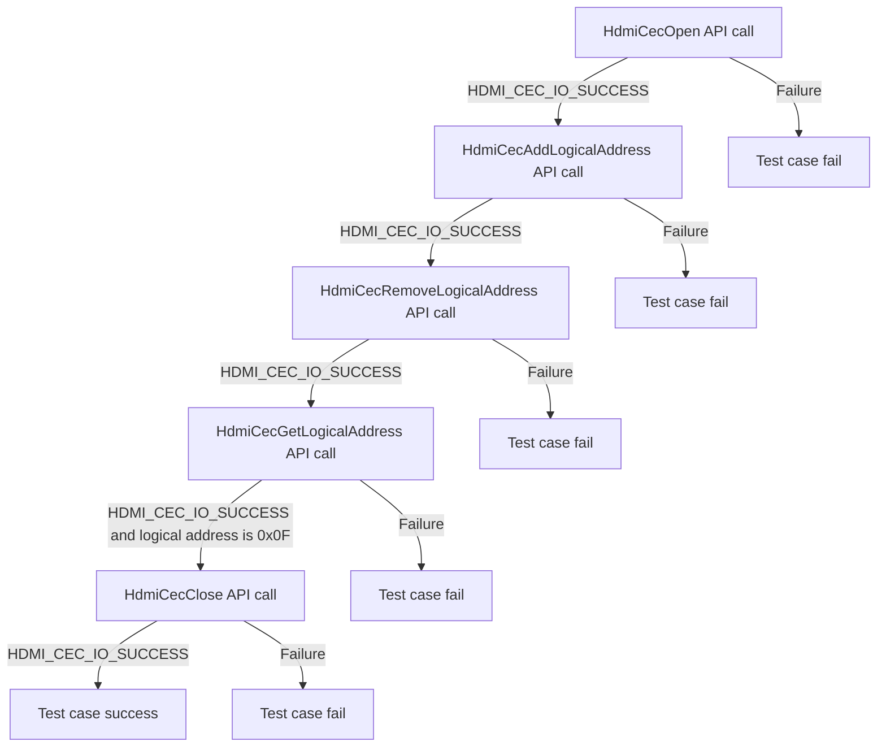
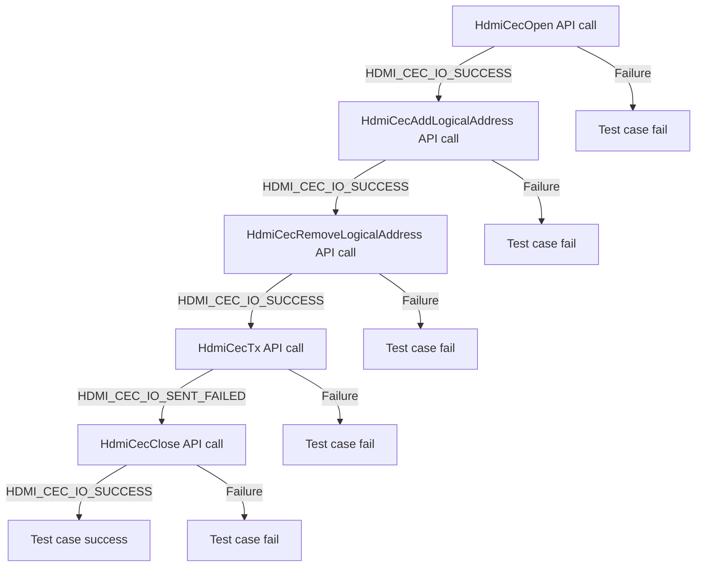
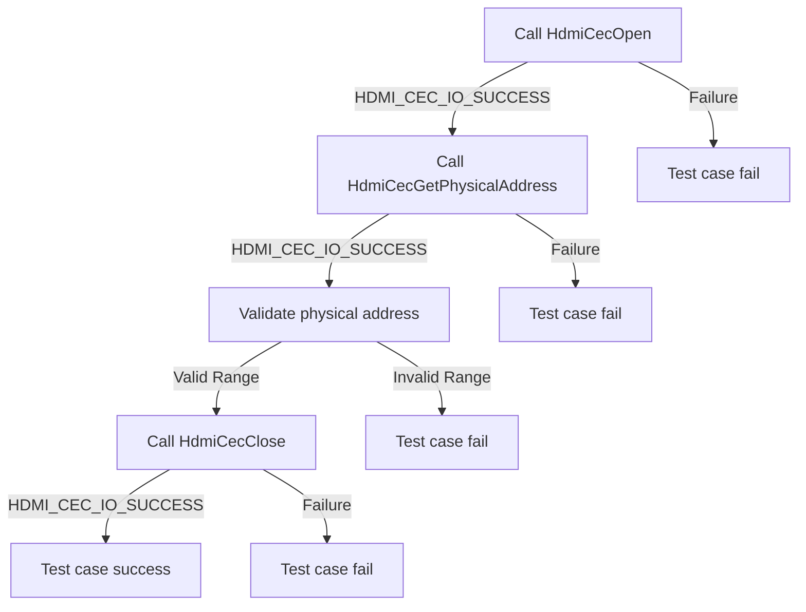
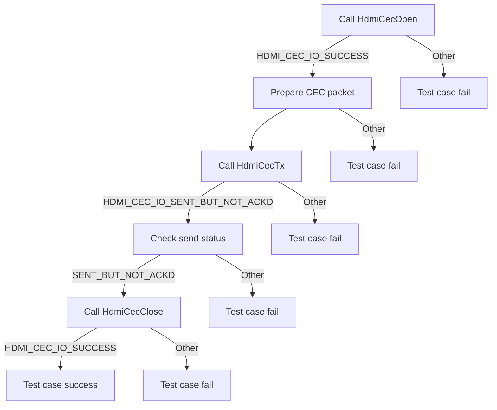

# HDMI CEC DRIVER Level 2 - Module Testing

| Version | Date(YY-MM-DD) | Comments |
| -------| ----- |  ----- |
| 1.0.0 | 15/05/24 | Inital Document |

## Table of Contents

- [HDMI CEC DRIVER Level 2 - Module Testing](#hdmi-cec-driver-level-2---module-testing)
  - [History](#history)
  - [Table of Contents](#table-of-contents)
  - [Overview](#overview)
    - [Acronyms, Terms and Abbreviations](#acronyms-terms-and-abbreviations)
    - [Definitions](#definitions)
    - [References](#references)
  - [Level 2 Test Suite](#level-2-test-suite)

## Overview

This document describes the level 2 testing suite for the HDMI CEC DRIVER module.

### Acronyms, Terms and Abbreviations

- `HAL` \- Hardware Abstraction Layer, may include some common components
- `HAL.h`  \- Abstracted defined API to control the hardware
- `HAL.c`  \- Implementation wrapper layer created by the `OEM` or `SoC` Vendor.
- `RDK`  \- Reference Design Kit for All Devices
- `RDK-B`  \- Reference Design Kit for Broadband Devices
- `RDK-V`  \- Reference Design Kit for Video Devices
- `UT`  \- Unit Test(s)
- `OEM`  \- Original Equipment Manufacture
- `SoC`  \- System on a Chip

### Definitions

- `Soc Vendor` \- Definition to encompass multiple vendors
- `Unit Tests` \- C Function tests that run on the target hardware
- `Common Testing Framework` \- Off the shelf 3rd Party Testing Framework, or framework that does not require infrastructure to control it. That's not to say it cannot be controlled via infrastructure if required. Examples of which are.
  - `GTest` \- Google Test Suit <https://google.github.io/googletest>
  - `CUnit` \- C Testing Suit <http://cunit.sourceforge.net/>
  - `Unity` \- C Embedded Testing Suit <http://www.throwtheswitch.org/unity>
  - `ut-core` \- Common Testing Framework <https://github.com/rdkcentral/ut-core>, which wraps a open-source framework that can be expanded to the requirements for future framework.

### References

- `Feedback Loops` \- <https://www.softwaretestingnews.co.uk/4-methods-to-improve-your-feedback-loops-and-supercharge-your-testing-process/>
- `Doxygen` \- SourceCode documentation tool - <https://www.doxygen.nl/index.html>
- `Black Box Testing` \- <https://en.wikipedia.org/wiki/Black-box_testing>

## Level 2 Test Suite

The following functions are expecting to test the module operates correctly.

### Test 1

|Title|Details|
|--|--|
|Function Name|`test_l2_hdmi_cec_driver_GetDefaultLogicalAddress`|
|Description|Get the logical address of the `DUT` without actually adding the Logical Address and the API should return 0x0F as the default logical address.|
|Test Group|Module : 02|
|Test Case ID|001|
|Priority|High|

**Pre-Conditions :**
None

**Dependencies :**
None

**User Interaction :**
If user chose to run the test in interactive mode, then the test case has to be selected via console.

#### Test Procedure :

| Variation / Steps | Description | Test Data | Expected Result | Notes|
| -- | --------- | ---------- | -------------- | ----- |
| 01 | Initialize the HDMI CEC HAL using HdmiCecOpen() | handle = valid pointer | HDMI_CEC_IO_SUCCESS | Should be successful |
| 02 | Get the logical address using HdmiCecGetLogicalAddress() | handle = handle from HdmiCecOpen(), logicalAddress = valid pointer | HDMI_CEC_IO_SUCCESS | Should be successful |
| 03 | Check that the logical address returned is 0x0F | logicalAddress = 0x0F | logicalAddress = 0x0F | Should be successful |
| 04 | Uninitialize the HDMI CEC HAL using HdmiCecClose() | handle = handle from HdmiCecOpen() | HDMI_CEC_IO_SUCCESS | Should be successful |

### Test 2

|Title|Details|
|--|--|
|Function Name|`test_l2_hdmi_cec_driver_AddAndGetLogicalAddress`|
|Description|Set up a legitimate logical address (0x00 to 0x0F) for the `DUT` using HAL APIs, then retrieve it to ensure proper functionality.|
|Test Group|Module : 02|
|Test Case ID|002|
|Priority|High|

**Pre-Conditions :**
None

**Dependencies :**
None

**User Interaction :**
If user chose to run the test in interactive mode, then the test case has to be selected via console.

#### Test Procedure :

| Variation / Steps | Description | Test Data | Expected Result | Notes|
| -- | --------- | ---------- | -------------- | ----- |
| 01 | Open HDMI CEC using HdmiCecOpen | handle = valid buffer | HDMI_CEC_IO_SUCCESS | Should be successful |
| 02 | Generate a random logical address and add it using HdmiCecAddLogicalAddress | handle = obtained handle, logicalAddress = random value between 0x00 and 0x0F | HDMI_CEC_IO_SUCCESS | Should be successful |
| 03 | Retrieve the logical address using HdmiCecGetLogicalAddress and check if it matches with logical address in step 2 | handle = obtained handle, logicalAddress = logicalAddress in step 2| HDMI_CEC_IO_SUCCESS | Should be successful |
| 04 | Close HDMI CEC using HdmiCecClose | handle = obtained handle | HDMI_CEC_IO_SUCCESS | Should be successful |

### Test 3

|Title|Details|
|--|--|
|Function Name|`test_l2_hdmi_cec_driver_RemoveLogicalAddress`|
|Description|Invoke the HAL API to delete the `DUT` logical address and verify that it is removed successfully.|
|Test Group|Module : 02|
|Test Case ID|003|
|Priority|High|

**Pre-Conditions :**
None

**Dependencies :**
None

**User Interaction :**
If user chose to run the test in interactive mode, then the test case has to be selected via console.

#### Test Procedure :

| Variation / Steps | Description | Test Data | Expected Result | Notes|
| -- | --------- | ---------- | -------------- | ----- |
| 01 | Open the HDMI CEC driver using HdmiCecOpen | handle = valid buffer | HDMI_CEC_IO_SUCCESS | Should be successful |
| 02 | Generate a random logical address and add it using HdmiCecAddLogicalAddress | handle = obtained handle, logicalAddress = random value between 0x0 and 0xF | HDMI_CEC_IO_SUCCESS | Should be successful |
| 03 | Remove the added logical address using HdmiCecRemoveLogicalAddress | handle = obtained handle, logicalAddress = added logical address | HDMI_CEC_IO_SUCCESS | Should be successful |
| 04 | Get the logical address using HdmiCecGetLogicalAddress | handle = obtained handle, logicalAddress = valid buffer | HDMI_CEC_IO_SUCCESS, logicalAddress = 0x0F | Should be successful |
| 05 | Close the HDMI CEC driver using HdmiCecClose | handle = obtained handle | HDMI_CEC_IO_SUCCESS | Should be successful |

### Test 4

|Title|Details|
|--|--|
|Function Name|`test_l2_hdmi_cec_driver_TestBroadcastCommandAfterDeletingLogicalAddress`|
|Description|After deleting the `DUT` logical address, try to send a broadcast command. Should fail to send during HAL Transmission call.|
|Test Group|Module : 02|
|Test Case ID|004|
|Priority|High|

**Pre-Conditions :**
None

**Dependencies :**
None

**User Interaction :**
If user chose to run the test in interactive mode, then the test case has to be selected via console.

#### Test Procedure :

| Variation / Steps | Description | Test Data | Expected Result | Notes|
| -- | --------- | ---------- | -------------- | ----- |
| 01 | Open HDMI CEC using HdmiCecOpen | handle = valid buffer | HDMI_CEC_IO_SUCCESS | Should be successful |
| 02 | Add logical address using HdmiCecAddLogicalAddress | handle = valid handle, logicalAddresses = random value between 0 and 15 | HDMI_CEC_IO_SUCCESS | Should be successful |
| 03 | Remove logical address using HdmiCecRemoveLogicalAddress | handle = valid handle, logicalAddresses = previously added logical address | HDMI_CEC_IO_SUCCESS | Should be successful |
| 04 | Try to send a broadcast command using HdmiCecTx after deleting logical address | handle = valid handle, buf = valid buffer, len = size of buffer, result = valid buffer | status = HDMI_CEC_IO_SENT_FAILED, result = SENT_FAILED | Should fail |
| 05 | Close HDMI CEC using HdmiCecClose | handle = valid handle | HDMI_CEC_IO_SUCCESS | Should be successful |

### Test 5

|Title|Details|
|--|--|
|Function Name|`test_l2_hdmi_cec_driver_GetPhysicalAddress`|
|Description|Verify the valid physical address allocated through the HAL function.|
|Test Group|Module : 02|
|Test Case ID|005|
|Priority|High|

**Pre-Conditions :**
None

**Dependencies :**
None

**User Interaction :**
If user chose to run the test in interactive mode, then the test case has to be selected via console.

#### Test Procedure :

| Variation / Steps | Description | Test Data | Expected Result | Notes|
| -- | --------- | ---------- | -------------- | ----- |
| 01 | Initialize the HDMI CEC HAL using HdmiCecOpen() | handle = valid pointer | HDMI_CEC_IO_SUCCESS | Should be successful |
| 02 | Get the physical address using HdmiCecGetPhysicalAddress() | handle = valid handle, physicalAddress = valid pointer | HDMI_CEC_IO_SUCCESS | Should be successful |
| 03 | Check the return status of HdmiCecGetPhysicalAddress() | status = return value of HdmiCecGetPhysicalAddress() | HDMI_CEC_IO_SUCCESS | Should be successful |
| 04 | Validate the physical address obtained | physicalAddress = obtained from HdmiCecGetPhysicalAddress() | physicalAddress should be in the range of 0 to maxAddress (4.4.4.4) | Should be successful |
| 05 | Close the HDMI CEC HAL using HdmiCecClose() | handle = valid handle | HDMI_CEC_IO_SUCCESS | Should be successful |

### Test 6

|Title|Details|
|--|--|
|Function Name|`test_l2_hdmi_cec_driver_TransmitCECCommand`|
|Description|Transmit a CEC Command (as per 1.4b HDMI CEC spec) to get the CEC Version for a logical address that doesn't exist.|
|Test Group|Module : 02|
|Test Case ID|006|
|Priority|High|

**Pre-Conditions :**
None

**Dependencies :**
None

**User Interaction :**
If user chose to run the test in interactive mode, then the test case has to be selected via console.

#### Test Procedure :

| Variation / Steps | Description | Test Data | Expected Result | Notes|
| -- | --------- | ---------- | -------------- | ----- |
| 01 | Call HdmiCecOpen to open a CEC session | handle = valid pointer | HDMI_CEC_IO_SUCCESS | Should be successful |
| 02 | Prepare a CEC packet | cecPacket = {0x0F, 0x9E, 0x00}, len = 3 | N/A | N/A |
| 03 | Call HdmiCecTx to transmit the CEC command | handle = valid handle, cecPacket = valid, len = 3 | HDMI_CEC_IO_SENT_BUT_NOT_ACKD | Should be successful |
| 04 | Check the return status of HdmiCecTx | status = return value of HdmiCecTx | HDMI_CEC_IO_SENT_BUT_NOT_ACKD | Should be successful |
| 05 | Check the send status | result = result paramter of HdmiCecTx | SENT_BUT_NOT_ACKD | Should be successful |
| 06 | Call HdmiCecClose to close the CEC session | handle = valid handle | HDMI_CEC_IO_SUCCESS | Should be successful |

